## 一、三角函数与反三角函数

### 正弦函数 $y=\sin x$ $

| 原函数                                                       | 反函数                                                       |
| ------------------------------------------------------------ | ------------------------------------------------------------ |
| **正弦函数** $y=\sin x$ 定义域：$x\in R$ 值域：$y\in[-1,1]$ 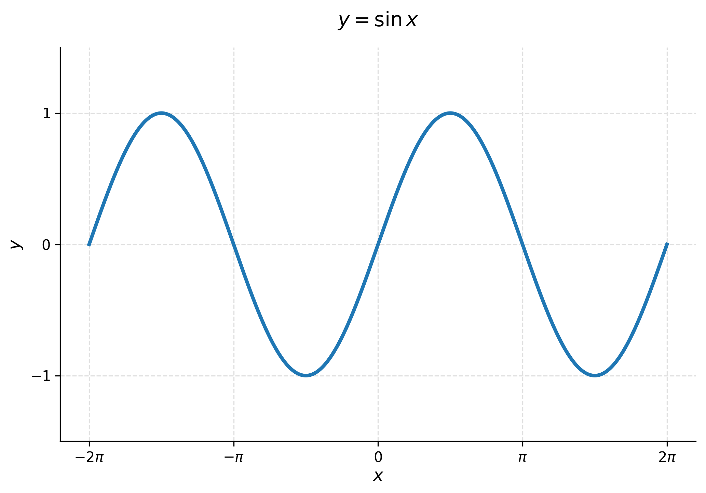 | **反正弦函数** $y=\arcsin x$ 定义域：$x\in[-1,1]$ 值域：$y\in[-\frac{\pi}{2},\frac{\pi}{2}]$ 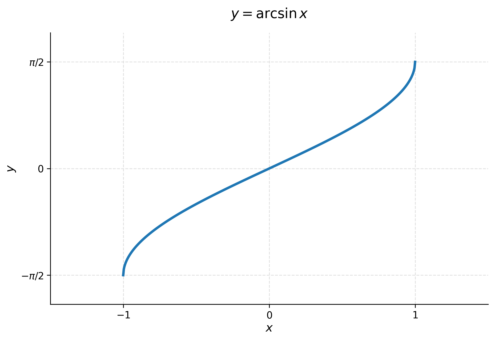 |

### 双曲正弦函数 $y=\sinh x$

| 原函数                                                       | 反函数                                                       |
| ------------------------------------------------------------ | ------------------------------------------------------------ |
| **双曲正弦函数** $y=\sinh x=\dfrac{e^x-e^{-x}}{2}$ 定义域：$x\in\mathbb{R}$ 值域：$y\in\mathbb{R}$ 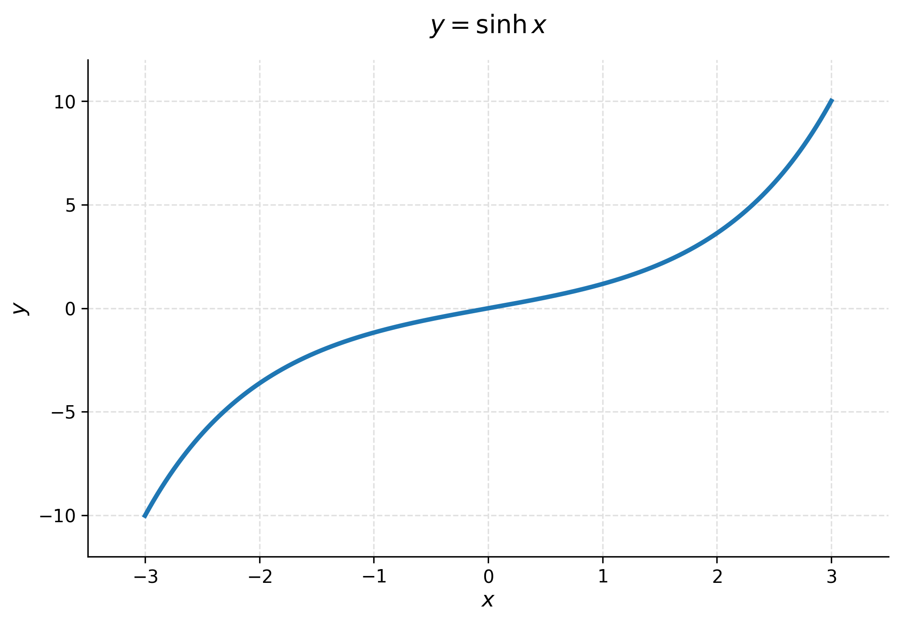 | **反双曲正弦函数** $y=\text{arcsinh}\ x=\ln\left(x+\sqrt{x^2+1}\right)$ 定义域：$x\in\mathbb{R}$ 值域：$y\in\mathbb{R}$ 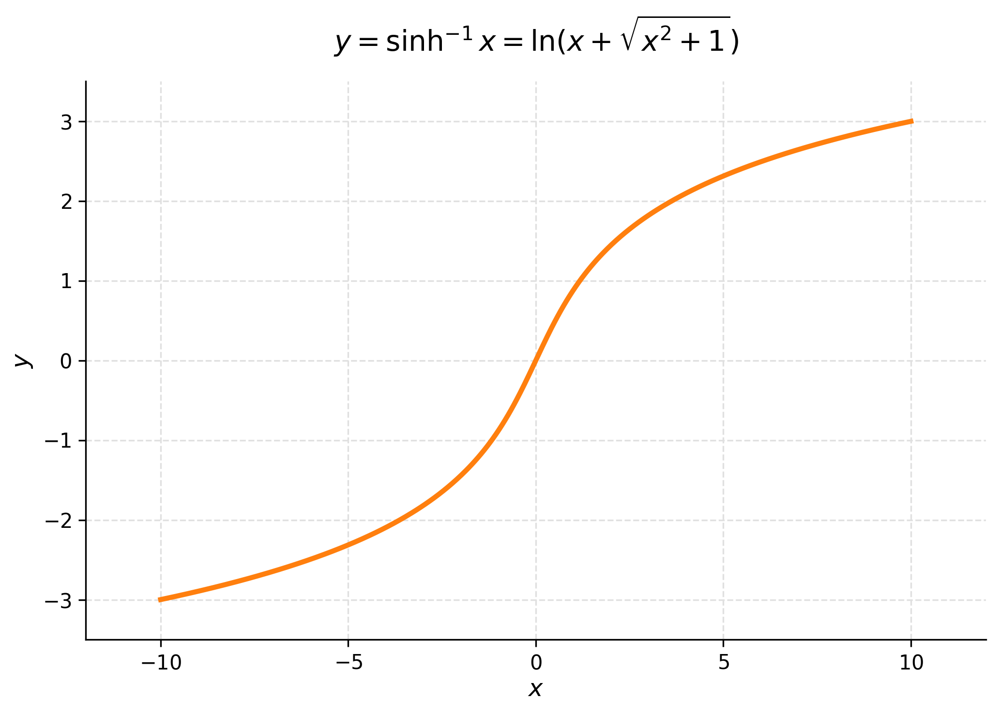 |

### 余弦函数 $y=\cos x$$

| 原函数                                                       | 反函数                                                       |
| ------------------------------------------------------------ | ------------------------------------------------------------ |
| **余弦函数** $y=\cos x$ 定义域：$x\in R$ 值域：$y\in[-1,1]$ 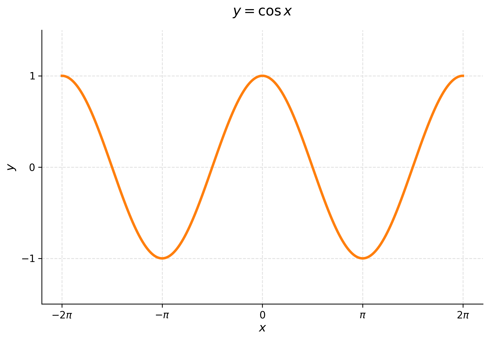 | **反余弦函数** $y=\arccos x$ 定义域：$x\in[-1,1]$ 值域：$y\in[0,\pi]$ 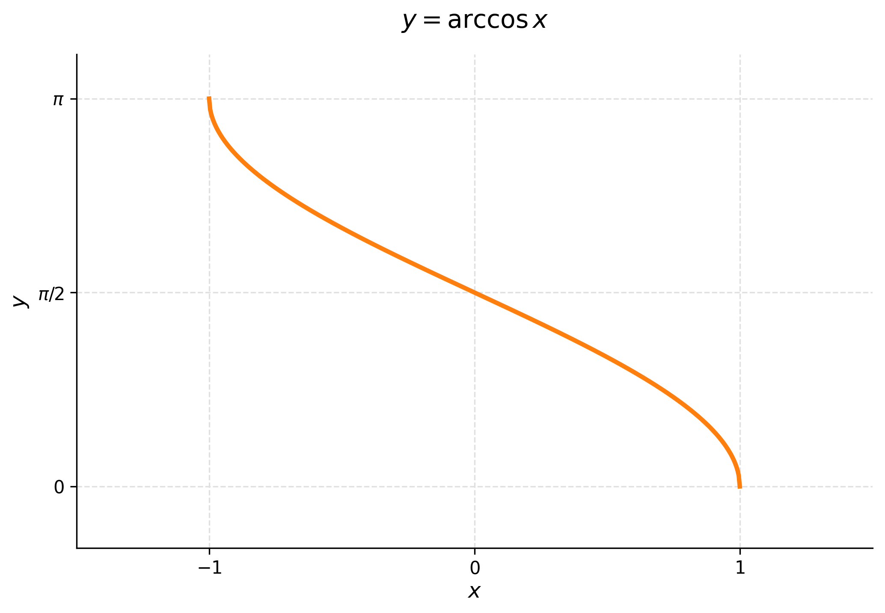 |

### 双曲余弦函数 $y=\cosh x$

| 原函数                                                       | 反函数                                                       |
| ------------------------------------------------------------ | ------------------------------------------------------------ |
| **双曲余弦函数** $y=\cosh x=\dfrac{e^x+e^{-x}}{2}$ 定义域：$x\in\mathbb{R}$ 值域：$y\in[1,+\infty)$ 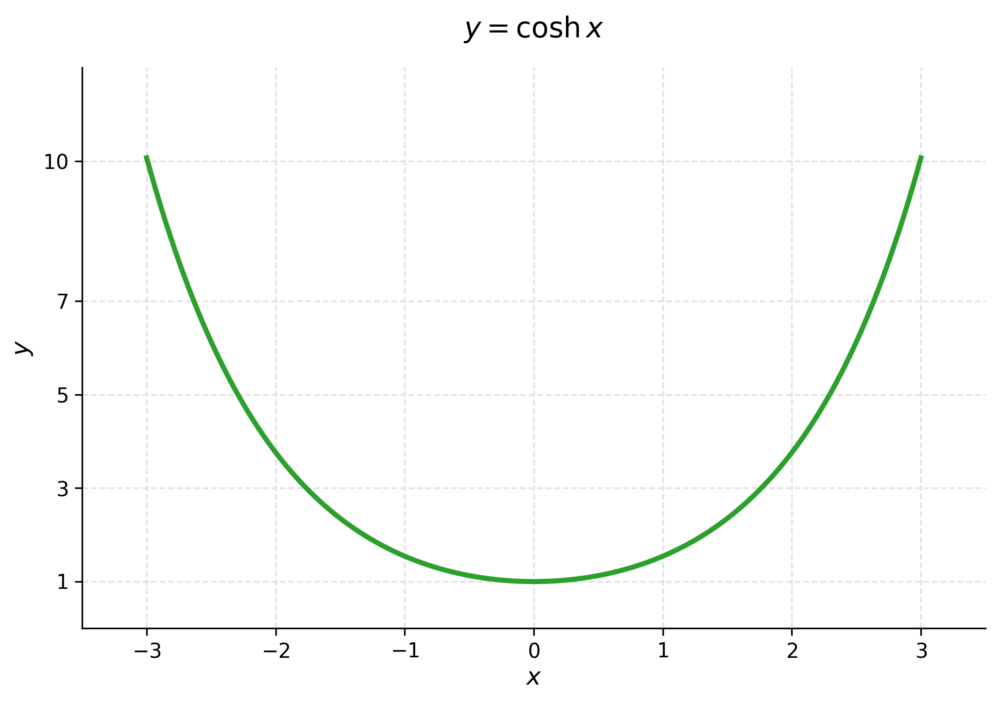 | **反双曲余弦函数** $y=\text{arccosh}\ x=\ln\left(x+\sqrt{x^2-1}\right)$ 定义域：$x\in[1,+\infty)$ 值域：$y\in[0,+\infty)$ 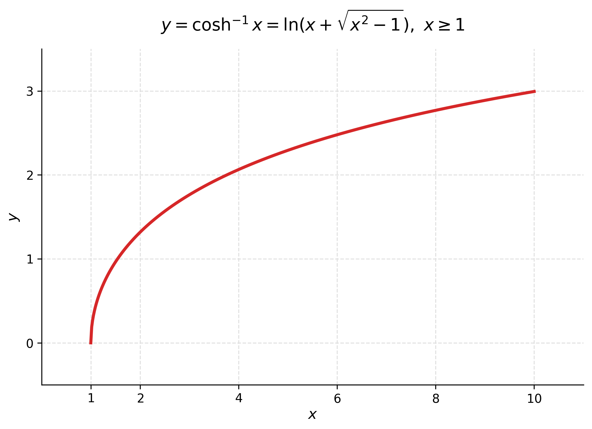 |

### 正切函数 $y=\tan x$

| 原函数                                                       | 反函数                                                       |
| ------------------------------------------------------------ | ------------------------------------------------------------ |
| **正切函数** $y=\tan x$ 定义域：$x\neq k\pi+\frac{\pi}{2}(k\in\mathbb{Z})$ 值域：$y\in R$ 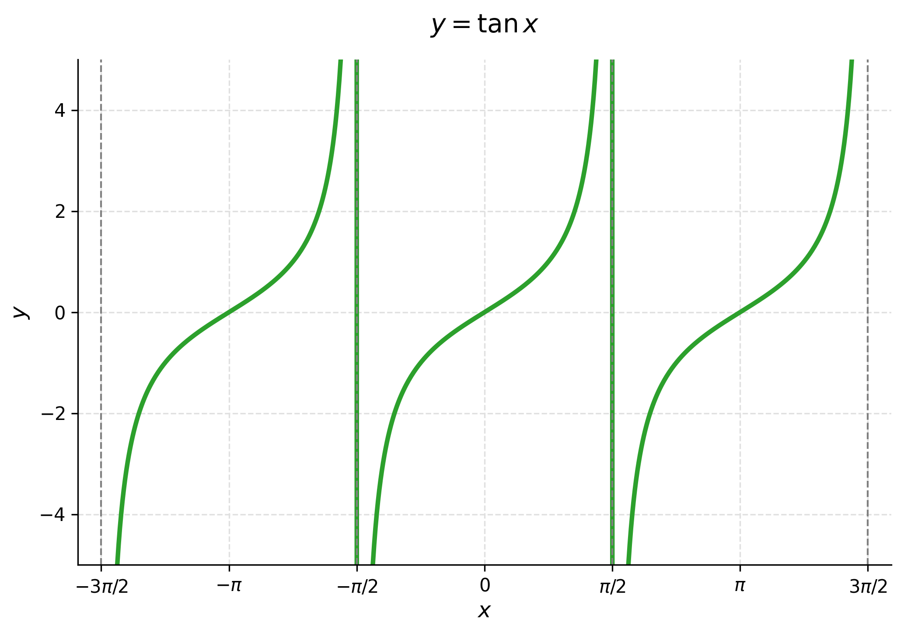 | **反正切函数** $y=\arctan x$ 定义域：$x\in R$ 值域：$y\in(-\frac{\pi}{2},\frac{\pi}{2})$ 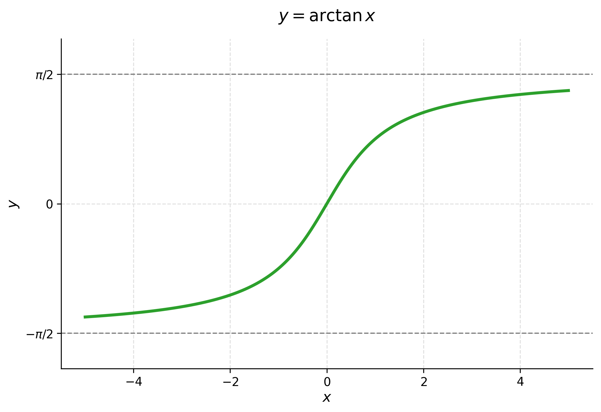 |

### 余切函数 $y=\cot x$ 

| 原函数                                                       | 反函数                                                       |
| ------------------------------------------------------------ | ------------------------------------------------------------ |
| **余切函数** $y=\cot x$ 定义域：$x\neq k\pi(k\in\mathbb{Z})$ 值域：$y\in R$ 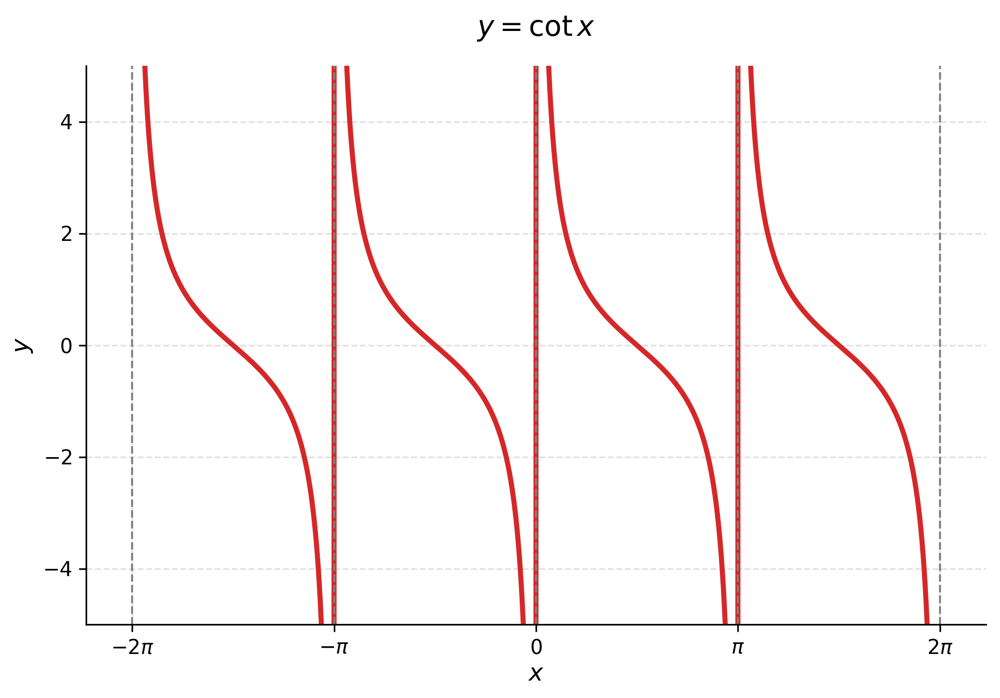 | **反余切函数** $y=\text{arccot}\ x$ 定义域：$x\in R$ 值域：$y\in(0,\pi)$ 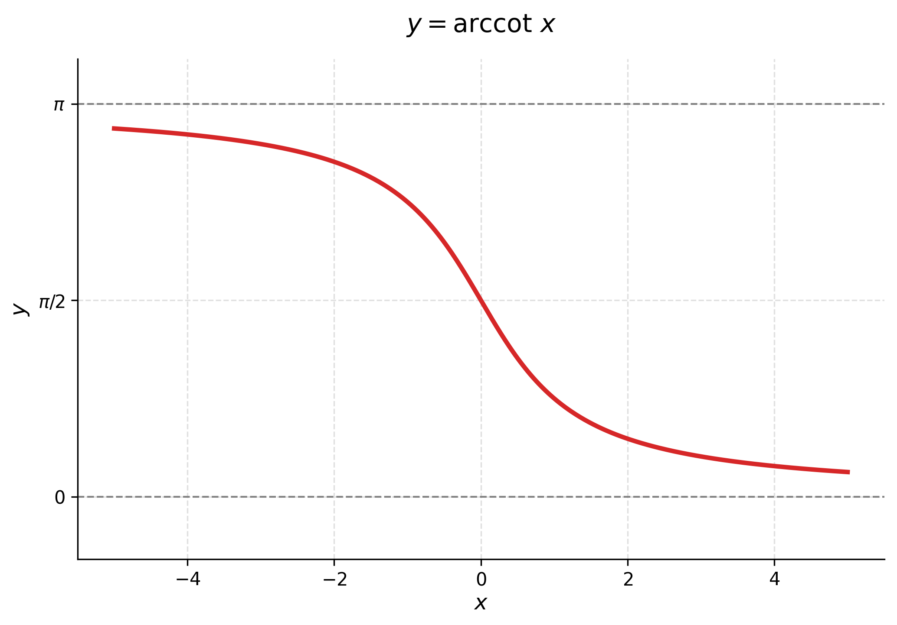 |

### 正割函数 $y=\sec x$

| 原函数                                                       | 反函数                                                       |
| ------------------------------------------------------------ | ------------------------------------------------------------ |
| **正割函数** $y=\sec x$ 定义域：$x\neq k\pi+\frac{\pi}{2}(k\in\mathbb{Z})$ 值域：$y\in(-\infty,-1]\cup[1,+\infty)$ 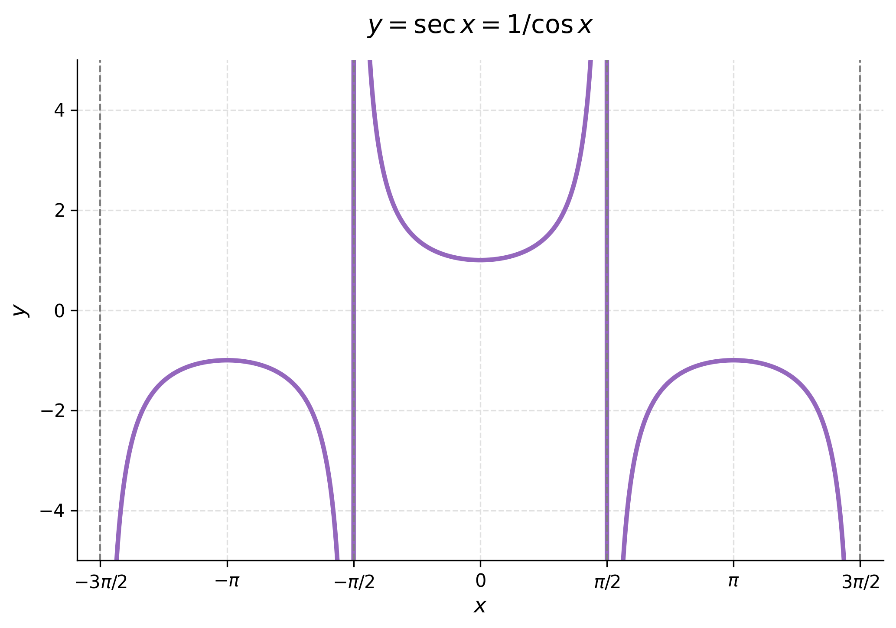 | **反正割函数** $y=\text{arcsec}\ x$ 定义域：$x\in(-\infty,-1]\cup[1,+\infty)$ 值域：$y\in[0,\frac{\pi}{2})\cup(\frac{\pi}{2},\pi]$ 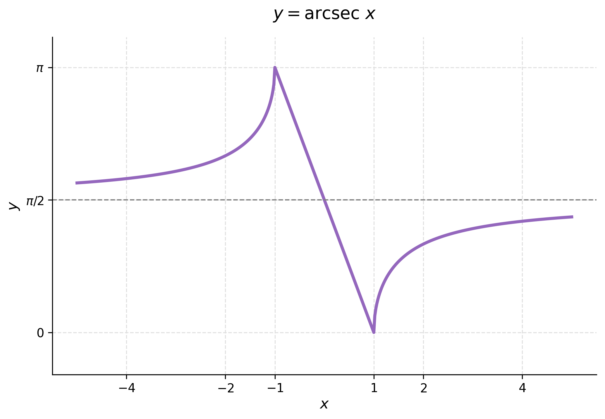 |

### 余割函数 $y=\csc x$

| 原函数 | 反函数 |
| --- | --- |
| **余割函数** $y=\csc x$ 定义域：$x\neq k\pi(k\in\mathbb{Z})$ 值域：$y\in(-\infty,-1]\cup[1,+\infty)$ 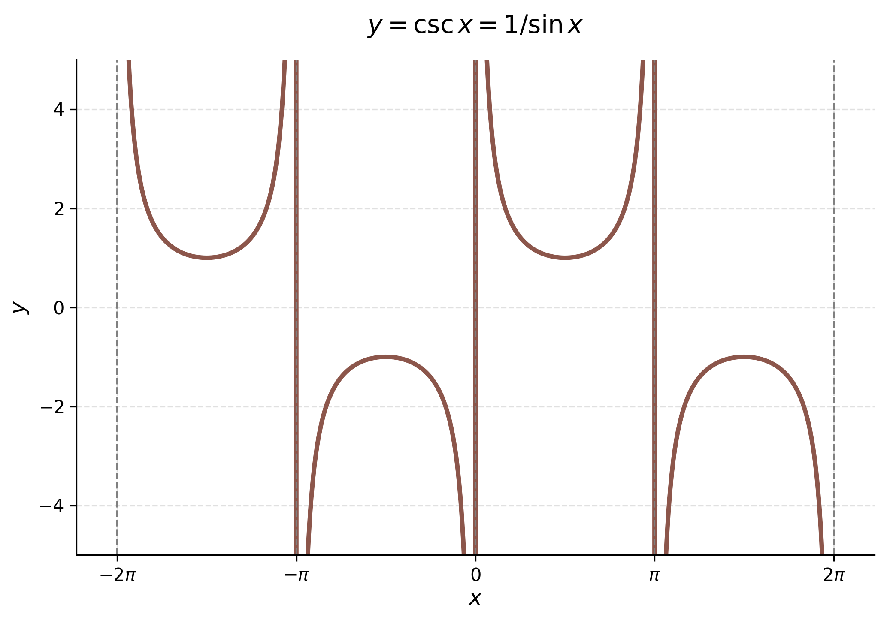 | **反余割函数** $y=\text{arccsc}\ x$ 定义|
|域：$x\in(-\infty,-1]\cup[1,+\infty)$ 值域：$y\in[-\frac{\pi}{2},0)\cup(0,\frac{\pi}{2}]$ 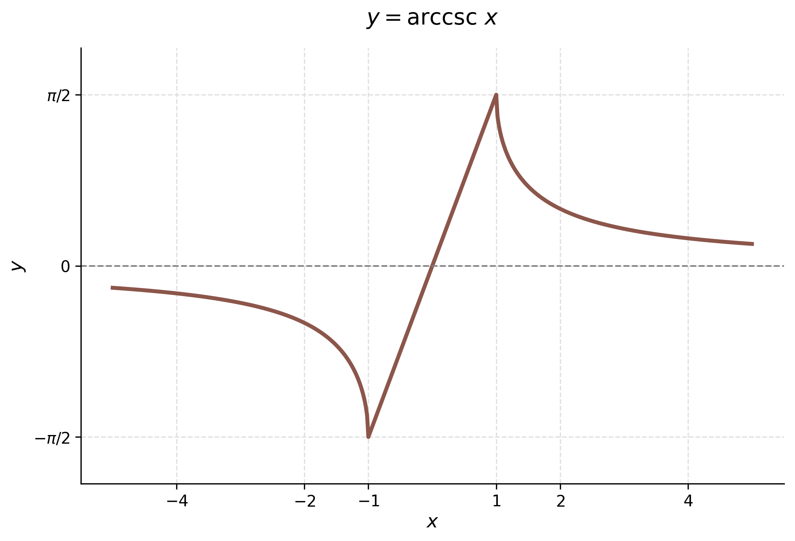 ||

## 二、常见泰勒展开（$x\to 0$）

### 基本展开

$$
\begin{aligned}
e^x &= 1+x+\frac{x^2}{2!}+\frac{x^3}{3!}+o(x^3)\\
\ln(1+x) &= x-\frac{x^2}{2}+\frac{x^3}{3}+o(x^3)\\
\sin x &= x-\frac{x^3}{3!}+\frac{x^5}{5!}+o(x^5)\\
\cos x &= 1-\frac{x^2}{2!}+\frac{x^4}{4!}+o(x^4)\\
	an x &= x+\frac{x^3}{3}+\frac{2x^5}{15}+o(x^5)\\
\arcsin x &= x+\frac{x^3}{6}+\frac{3x^5}{40}+o(x^5)\\
\arctan x &= x-\frac{x^3}{3}+\frac{x^5}{5}+o(x^5)
\end{aligned}
$$

### 二项式型（$x\to 0$）

对任意常数 $\alpha$，有
$$
(1+x)^{\alpha}=1+\alpha x+\frac{\alpha(\alpha-1)}{2}x^2+\frac{\alpha(\alpha-1)(\alpha-2)}{6}x^3+o(x^3)
$$

常用特例：
$$
\begin{aligned}
\frac{1}{1-x} &= 1+x+x^2+x^3+o(x^3)\\
\frac{1}{1+x} &= 1-x+x^2-x^3+o(x^3)\\
\sqrt{1+x} &= 1+\frac{x}{2}-\frac{x^2}{8}+\frac{x^3}{16}+o(x^3)
\end{aligned}
$$

## 三、常见等价无穷小（$x\to 0$）

### 一阶等价

$$
\begin{aligned}
\sin x &\sim x \\
1-\cos x &\sim \frac{x^2}{2} \sim x-\ln(x+1)\\ 
\tan x &\sim x \\
\arcsin x &\sim x \\
\arctan x &\sim x \\
e^x-1 &\sim x \\
\ln(1+x) &\sim x \\
(1+x)^{\alpha}-1 &\sim \alpha x \\
\sqrt{1+x}-1 &\sim \frac{x}{2} \\
a^x-1 &\sim x\ln a\quad(a>0,\ a\neq 1\\
)
\end{aligned}
$$

### 常用二阶/三阶等价
$$
\begin{aligned}
1-\cos x &\sim \frac{x^2}{2}\\
x-\sin x &\sim \frac{x^3}{6}\\
	an x - x &\sim \frac{x^3}{3}
\end{aligned}
$$