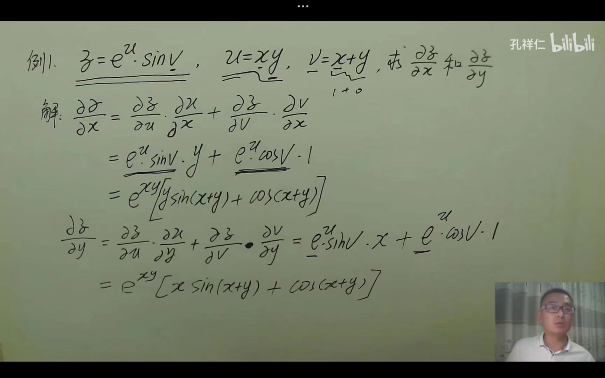
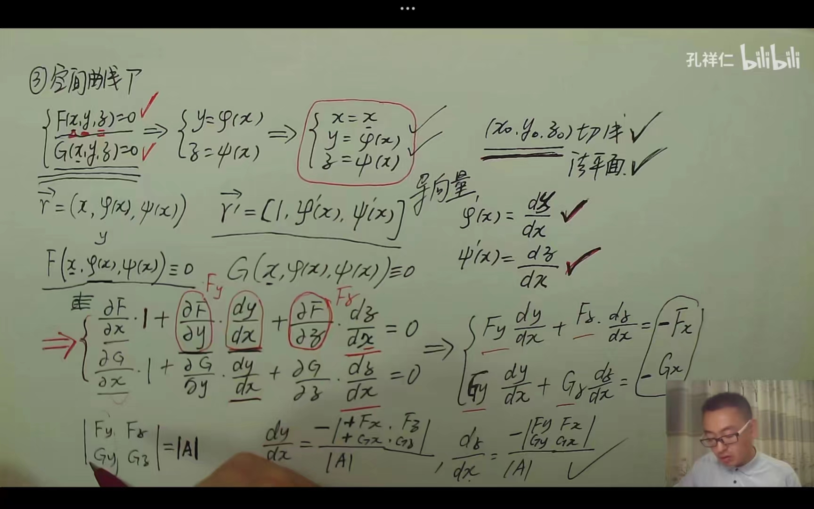
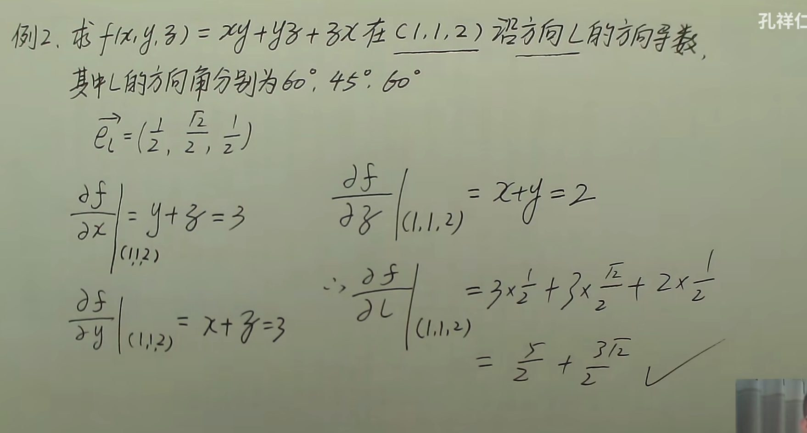
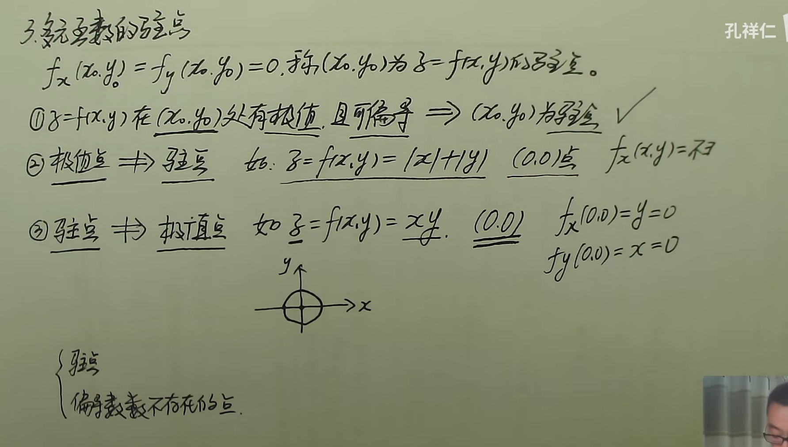
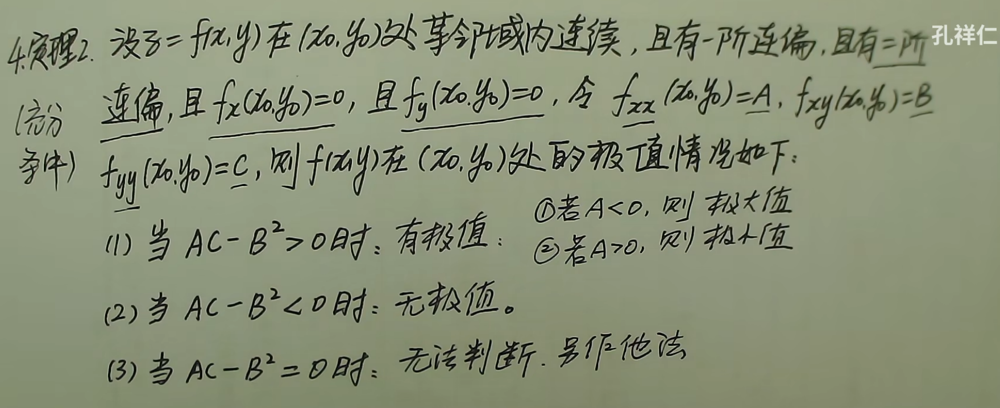

## 偏导

抽象函数求偏导：函数$F(x^2,3xy)$对x求偏导可得,可参考复合求导
$$
2x\cdot F_{x^2}'(x^2,3xy)+3y\cdot F_{3xy}'(x^2,3xy)
$$
先对x求偏导再对y求偏导=先对y求偏导再对x求偏导
$$
\frac{\partial ^2z}{\partial x \partial y}=\frac{\partial ^2z }{\partial y \partial x}
$$

### 拉普拉斯方程
$$
\mu=\frac{1}{\sqrt{x^2+y^2+z^2}}
$$

则
$$
\frac{\partial^2\mu}{\partial x^2}+\frac{\partial^2\mu}{\partial y^2}+\frac{\partial^2\mu}{\partial z^2}=0
$$

## 复合求导

已知$z=f(u,v),u,v$是关于$t$的函数，则
$$
\frac{dz}{dt}=\frac{\partial z}{\partial u}\cdot \frac{du}{dt}+\frac{\partial z}{\partial v}\cdot \frac{dv}{dt}
$$
若$u,v$是关于$(x,y)$的函数，则

$$
\begin{cases}
\frac{\partial z}{\partial x}=\frac{\partial z}{\partial u} \cdot \frac{\partial u}{\partial x}+\frac{\partial z}{\partial v}\cdot \frac{\partial v}{\partial x} \\
\frac{\partial z}{\partial y}=\frac{\partial z}{\partial u} \cdot \frac{\partial u}{\partial y}+\frac{\partial z}{\partial v}\cdot \frac{\partial v}{\partial y}
\end{cases}
$$

## 微分

全微分
$$
dz=\frac{\partial z}{\partial x}dx+\frac{\partial z}{\partial y}dy
$$

## 隐函数求导

$w=F(x,y)在P(x_0,y_0)$处某领域内有连续偏导数，且$F(x_0,y_0)=0,F_y(x_0,y_0)≠0$，则
$$
\frac{dy}{dx}=-\frac{F_x}{F_y}=\frac{\frac{\partial F}{\partial x}}{\frac{\partial F}{\partial y}}
$$
$w=F(x,y，z)在P(x_0,y_0,z_0)$处某领域内有连续偏导数，且$F(x_0,y_0,z_0)=0,F_z(x_0,y_0,z_0)≠0$，则
$$
\frac{\partial z}{\partial x}=-\frac{F_x(x_0,y_0,z_0)}{F_z(x_0,y_0,z_0)}\\
\frac{\partial z}{\partial y}=-\frac{F_y(x_0,y_0,z_0)}{F_z(x_0,y_0,z_0)}
$$

> $z=f(x,y),F(x,y,z)=F(x,y,f(x,y))=0,$分别对x和y求偏导可得
> $$
> F'_x(x,y,z)+F_z'(x,y,z)\frac{\partial z}{\partial x}=0\\
> F'_y(x,y,z)+F_z'(x,y,z)\frac{\partial z}{\partial y}=0
> $$
> 因此需要分子对F的偏导数存在，即$F_z'(x,y,z)$存在

## 求空间曲线切线和法平面

$\vec{r}=\vec{f}(t)=(\phi(t),\psi(t),\omega(t))$,在$t_0$处可导，切向量为$\vec{n}=(\phi^{'}(t_0),\psi^{'}(t_0),\omega^{'}(t_0))$

则点向式切线
$$
\frac{x-x_0}{\phi^{'}(t_0)}=\frac{y-y_0}{\psi^{'}(t_0)}=\frac{z-z_0}{\omega^{'}(t_0)}
$$

由于得到切向量$\vec{n}=(\phi^{'}(t_0),\psi^{'}(t_0),\omega^{'}(t_0))$,可得到平面的点法式方程
$$
\phi^{'}(t_0)\cdot(x-x_0)+\psi^{'}(t_0)\cdot(y-y_0)+\omega^{'}(t_0)\cdot(z-z_0)=0
$$
**空间直线一般式方程求解**
$$
\begin{cases}
A_1x + B_1y + C_1z + D_1 = 0 \\
A_2x + B_2y + C_2z + D_2 = 0
\end{cases}
$$
可以带入化简得到
$$
\begin{cases}
x=x \\
y=\phi(x) \\
z=\psi(x)
\end{cases}
$$
所以切向量$\vec{n}=(1,\phi^{'}(x),\psi^{'}(x))$,

## 求曲面的法线和切平面

平面面$w=F(x,y,z)=0在M(x_0,y_0,z_0)$处有连续偏导数，求过$M$点的切平面及法线

通过对曲面$w$的$x,y,z$三个方向求偏导并带入$M$点的数据，得到法向量$\vec{n}=(F_x(x_0,y_0,z_0),F_y(x_0,y_0,z_0),F_z(x_0,y_0,z_0))$,通过点法式求出切平面
$$
F_x(x_0,y_0,z_0)(x-x_0)+F_y(x_0,y_0，z_0)(y-y_0)+F_z(x_0,y_0,z_0)(z-z_0)=0
$$
点向式得到法线方程
$$
\frac{x-x_0}{F_x(x_0,y_0,z_0)}=\frac{y-y_0}{F_y(x_0,y_0,z_0)}=\frac{z-z_0}{F_z(x_0,y_0,z_0)}
$$
对于非平面方程来说$z=f(x,y)$,则化为$f(x,y)-z=0$,同理于上文。

## 方向导数

$$
\frac{\partial f}{\partial L}|_{(x_0,y_0)}=f_x(x_0,y_0)cos\alpha +f_y(x_0,y_0)cos\beta
$$

## 多元函数极值

极值点：周围的函数值都比这个点的函数的值要小或者要大

极值充分不必要条件：函数在$(x_0,y_0)$处取极值且可偏导（间断点），则$f_x'(x_0,y_0)=f_y(x_0,y_0)=0$

驻点：函数在$(x_0,y_0)$处$f_x'(x_0,y_0)=f_y(x_0,y_0)=0$

## 多元函数最值

1. 根据上一方法求出极值
2. 求处偏导数不存在的点的函数值
3. 求出边界点上的函数值
4. 比较数值

## 条件极值

即求一个函数在某种条件/限制下的极值

求$z=f(x,y)$,在$p(x,y)=0$条件下的极值,可设立$L(x,y)=f(x,y)-\lambda p(x,y)$,求偏导得到
$$
\begin{cases}
L_x=f_x(x,y)+\lambda p_x(x,y)=0 \\
L_y=f_y(x,y)+\lambda p_y(x,y)=0 \\
p(x,y)=0
\end{cases}
$$
从而求解出极值点和极值
