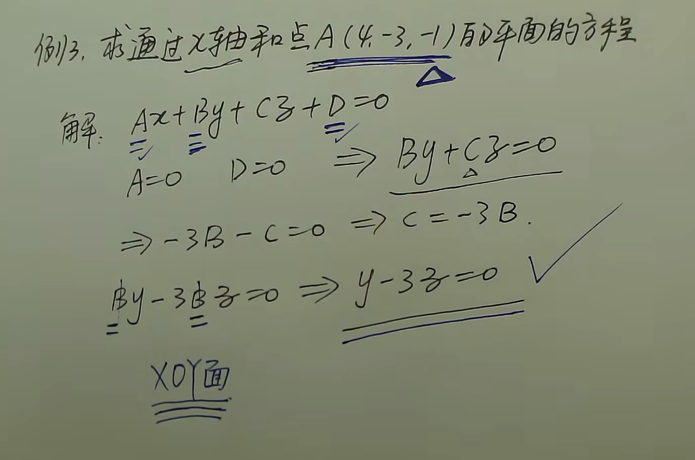
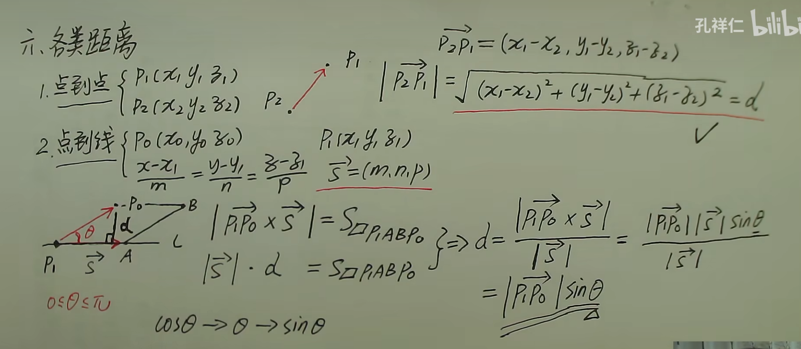
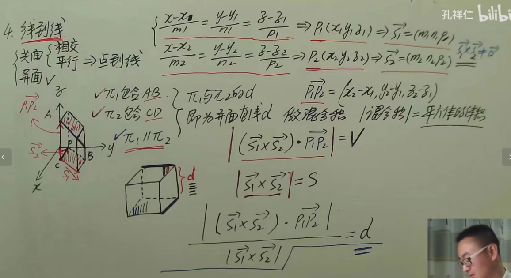
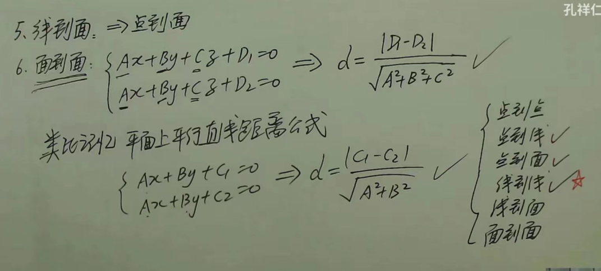
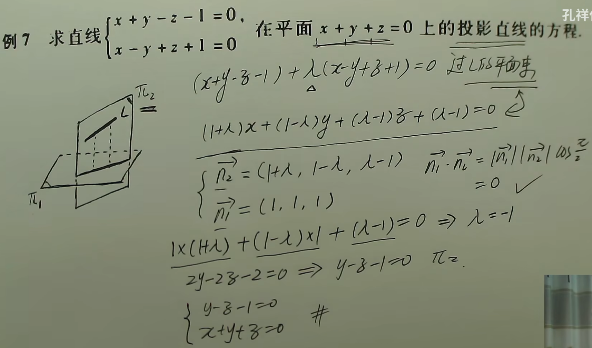
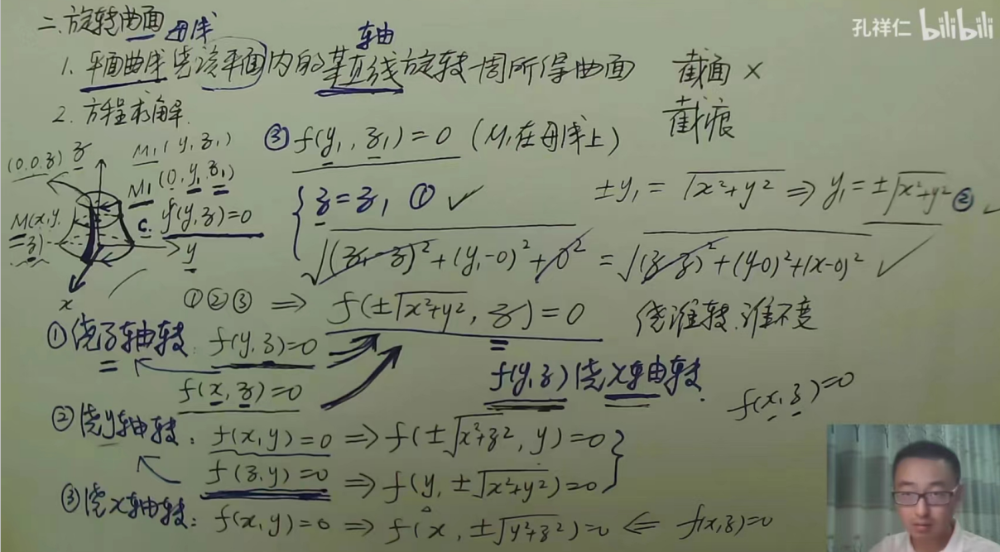
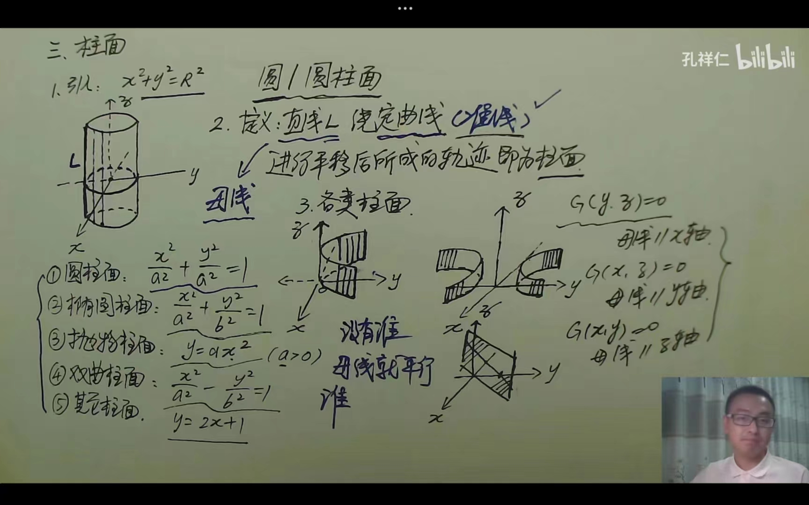

## 向量

向量夹角$0\leq \alpha \leq \pi$,$\vec{AB}=B-A$,指向被减

### 方向角与方向余弦

$\vec{r}=\vec{OM}=(x,y,z)$，其中，M点坐标为$(x,y,z)$,$\alpha,\beta,\gamma$分别为$\vec{r}$与坐标轴$x,y,z$所成的夹角，$\cos \alpha ,\cos \beta,\cos \gamma$为$\vec{r}$的方向余弦

有
$$
\cos \alpha =\frac{x}{|\vec{r}|}\\
\cos \beta =\frac{y}{|\vec{r}|}\\
\cos \gamma =\frac{z}{|\vec{r}|}\\
$$
又可进一步得到
$$
\cos^2 \alpha+\cos^2\beta+\cos^2\gamma=1
$$
$\vec{r}$的单位向量为$(cos\alpha,\cos \beta,\cos \gamma)$

### 向量积

方向：右手准则，从第一个乘数开始向另一个乘数转动，大拇指方向为叉乘方向

#### 向量积的计算

设三维向量

$$
\vec{a}=(a_1,a_2,a_3)\\
\vec{b}=(b_1,b_2,b_3)\\
$$

则向量叉乘记作：

$$
\vec{a}\times\vec{b}
$$

叉乘的结果仍然是一个向量。

向量叉乘可以写成三阶行列式：

$$
\vec{a}\times\vec{b}
=
\begin{vmatrix}
\vec{i} & \vec{j} & \vec{k} \\
a_1 & a_2 & a_3 \\
b_1 & b_2 & b_3
\end{vmatrix}
$$

其中：

- $\vec{i}$ 表示 $x$ 轴方向的单位向量；
- $\vec{j}$ 表示 $y$ 轴方向的单位向量；
- $\vec{k}$ 表示 $z$ 轴方向的单位向量。

按照三阶行列式计算即可

#### 向量积的几何意义

向量叉乘的结果是一个新的向量。

这个向量满足两个特点：

$$
\vec{a}\times\vec{b}\perp \vec{a}
$$

$$
\vec{a}\times\vec{b}\perp \vec{b}
$$

它的方向可以用右手定则判断：

将右手四指从 $\vec{a}$ 的方向弯向 $\vec{b}$ 的方向，大拇指所指的方向就是向量积的方向

叉乘结果的模长为：

$$
|\vec{a}\times\vec{b}|
=
|\vec{a}||\vec{b}|\sin\theta
$$

其中，$\theta$ 是 $\vec{a}$ 与 $\vec{b}$ 的夹角。

因此，叉乘的模长等于以 $\vec{a}$ 和 $\vec{b}$ 为邻边的平行四边形面积。

### 混合积

#### 混合积的计算

设：

$$
\vec{a}=(a_1,a_2,a_3)\\

\vec{b}=(b_1,b_2,b_3)\\

\vec{c}=(c_1,c_2,c_3)\\
$$

则：

$$
\vec{a}\cdot(\vec{b}\times\vec{c})
=
\begin{vmatrix}
a_1 & a_2 & a_3 \\
b_1 & b_2 & b_3 \\
c_1 & c_2 & c_3
\end{vmatrix}
$$

按照三阶行列式计算即可

#### 混合积的几何意义

混合积：

$$
\vec{a}\cdot(\vec{b}\times\vec{c})
$$

的绝对值表示以 $\vec{a}$、$\vec{b}$、$\vec{c}$ 为棱的平行六面体的体积。

即：

$$
V=
|\vec{a}\cdot(\vec{b}\times\vec{c})|
$$

#### 混合积的性质

- 循环改为不改变结果

$$
\vec{a}\cdot(\vec{b}\times\vec{c})=\vec{b}\cdot(\vec{c}\times\vec{a})=\vec{c}\cdot(\vec{a}\times\vec{b})
$$

- 交换任意两个向量，结果变号

$$
\vec{a}\cdot(\vec{b}\times\vec{c})=-\vec{a}\cdot(\vec{c}\times\vec{b})
$$

## 平面方程

### 平面点法式方程

核心是通过平面的法向量$\vec{n}=(A,B,C)$与平面上一点$(x_0,y_0,z_0)$乘为0来构造方程

形式：$A(x-x_0)+B(y-y_0)+C(z-z_0)=0$

具体情形：

1. 已知平面上一点以及该平面的法向量，设另一点构造平面上的一条向量点乘构造平面方程
2. 已知平面上三个点，可以得到三条向量，通过叉乘得到平面法向量，同理形式1

### 平面的一般式方程

形式：$Ax+By+Cz+D=0$，$\vec{n}=(A,B,C)$

特点：

- 若$D=0$<=>平面过0点

- 若$A=0$<=>$\vec{n}\perp x$轴；平面平行$x$轴
- 若$A=B=0$<=>$\vec{n}\perp XoY$；平面平行$XoY$面

具体情形：

1. 平面通过x轴和某点，则A和D为0，带入点坐标得到B,C的关系式，同除B/C，可得平面方程

### 截距式方程

形式：$\frac{x}{a}+\frac{y}{b}+\frac{z}{c}=1$

本质上为平面与三轴的交点为$(a,0,0),(0,b,0),(0,0,c)$

- 若$a=0，x$恒为0，平面为$YoZ$平面
- 不能有两个为0，否则是一条直线

## 空间直线方程

### 一般式

两平面相交实现，平面的方程可以用其他形式表示
$$
\begin{cases}
A_1x + B_1y + C_1z + D_1 = 0 \\
A_2x + B_2y + C_2z + D_2 = 0
\end{cases}
$$

转为点向式：

1. 找两个点，可以两式相加，两式相减来找出两个解转化为点向式
2. 找一个点，以及两个法向量做叉乘找到平行向量，从而转为点向式

### 点向式

已知直线过一点$(x_0,y_0,z_0)$和一条与该直线平行的向量$\vec{s}=(m,n,p)$

形式：$\frac{x-x_0}{m}=\frac{y-y_0}{n}=\frac{z-z_0}{p}$

- 若$m=0$,$x$恒等于$x_0$,直线垂直$x$轴，也就平行于$YoZ$

    > 几何意义，为过一点平行于YoZ的平面上的任意一条线

- 若$m=n=0$,$x$恒等于$x_0$,$y$恒等于$y_0$，直线平行于$z$轴

    > 几何意义，为过一点平行于$z$轴的一条直线

### 参数式

形式：$t=\frac{x-x_0}{m}=\frac{y-y_0}{n}=\frac{z-z_0}{p}$

本质为
$$
\begin{cases}
x = x_0 + m t \\
y = y_0 + n t \\
z = z_0 + p t
\end{cases}
$$

### 两点式

通过两点得到向量，然后通过点向式得到方程方程

形式：$\frac{x-x_1}{x_2-x_1}=\frac{y-y_1}{y_2-y_1}=\frac{z-z_1}{z_2-z_1}$

## 四类夹角

### 两向量夹角$\theta \in [0,\pi]$

$\vec{a}=(m_1,n_1,p_1),\vec{b}=(m_2,n_2,p_2)$，两向量夹角$\theta \in [0, \pi]$
$$
cos\theta =\frac{\vec{a}\cdot \vec{b}}{|\vec{a}|\vec{b}|}=\frac{m_1m_2+n_1n_2+p_1p_2}{\sqrt{m_1^2+n_1^2+p_1^2}\cdot \sqrt{m_2^2+n_2^2+p_2^2}}
$$

### 两直线夹角$\phi \in [0,\frac{\pi}{2}]$

$$
\begin{cases}
L_1:\frac{x-x_1}{m_1}=\frac{y-y_1}{n_1}=\frac{z-z_1}{p_1} \\
L_2:\frac{x-x_2}{m_2}=\frac{y-y_2}{n_2}=\frac{z-z_2}{p_2} \\
\end{cases}
$$

可得到方向向量$\vec{s_1}=(m_1,n_1,p_1),\vec{s_2}=(m_2,n_2,p_2)$,然后同理于两向量夹角

- $L_1\perp L_2<=>cos\phi=0<=>m_1m_2+n_1n_2+p_1p_2=0$
- $L_1//L_2<=>\frac{m_1}{m_2}=\frac{n_1}{n_2}=\frac{p_1}{p_2}$

### 直线与平面夹角$\phi \in [0,\frac{\pi}{2}]$

$$
\begin{cases}
L:\frac{x-x_0}{m}=\frac{y-y_0}{n}=\frac{z-z_0}{p} \\
S:Ax+By+Cz+D=0 \\
\end{cases}
$$

可以通过求解直线与平面法向量$\vec{n}=(A,B,C)$的夹角来推出与平面的夹角，
$$
sin\phi = |cos\theta|=\frac{|Am+Bn+Cp|}{\sqrt{A^2+B^2+C^2}\cdot\sqrt{m^2+n^2+p^2}}
$$

- $L \perp S<=>L//\vec{n}<=>\frac{A}{m}=\frac{B}{n}=\frac{C}{p}$
- $L//SM<=>L \perp \vec{n}<=>Am+Bn+Cp=0$

### 两平面夹角$\phi \in [0,\frac{\pi}{2}]$

$$
\begin{cases}
S_1:A_1x+B_1y+C_1z+D_1=0 \\
S_2:A_2x+B_2y+C_2z+D_2=0 \\
\end{cases}
$$

通过求解两平面法向量$\vec{n_1}=(A_1,B_1,C_1),\vec{n_2}=(A_2,B_2,C_2)$的夹角即为两平面的夹角
$$
cos\phi = |cos\theta|=\frac{|A_1A_2+B_1B_2+C_1C_2|}{\sqrt{A_1^2+B_1^2+C_1^2}\cdot\sqrt{A_2^2+B_2^2+C_2^2}}
$$

- $S_1\perp S_2<=>\vec{n_1} \perp \vec{n_2}<=>A_1A_2+B_1B_2+C_1C_2=0$
- $S_1// S_2<=>\vec{n_1} // \vec{n_2}<=>\frac{A_1}{A_2}=\frac{B_1}{B_2}=\frac{C_1}{C_2}$

## 六类距离

### 点到点距离

有$P_1(x_1,y_1,z_1),P_2(x_2,y_2,z_2)$，则
$$
l=\sqrt{(x_1-x_2)^2+(y_1-Y_2)^2+(z_1-z_2)^2}
$$

### 点到线距离

$$
\begin{cases}
P_0(x_0,y_0,z_0)\\
\frac{x-x_1}{m}=\frac{y-y_1}{n}=\frac{z-z_1}{p}
\end{cases}
$$

在线上任意取两个点$P_1(x_1,y_1,z_1),P_2(x_2,y_2,z_2)$,然后得到$\vec{P_1P_0}，\vec{P_1P_2}$，所以可以通过两向量算出夹角余弦值$\cos\theta$，从而可得到点到直线的距离
$$
d=|\vec{P_1P_0}|\sin \theta
$$

### 点到面距离

$$
\begin{cases}
P_0(x_0,y_0,z_0)\\
Ax+By+Cz+D=0
\end{cases}
$$

在平面上取一点$P_1(x_1,y_1,z_1)$,然后可以计算出$\vec{P_1P_0}$与平面法向量$\vec{n}=(A,B,C)$的夹角余弦值$\cos \theta$,从而可得到点到平面距离
$$
d=|\vec{P_1P_0}||\cos \theta|
$$

### 线到线距离

$$
\begin{cases}
\frac{x-x_1}{m_1}=\frac{y-y_1}{n_2}=\frac{z-z_1}{p_1}\\
\frac{x-x_2}{m_2}=\frac{y-y_2}{n_2}=\frac{z-z_2}{p_2}\\
\end{cases}
$$

可得平行向量$\vec{S_1}(m_1,n_1,p_1),\vec{S_2}(m_2,n_2,p_2)$，通过构建六面体来计算距离。

### 线到面距离

本质上为直线上某点到平面距离

### 面到面距离

## 平面束

即通过定直线的所有平面的集合

某个直线可以由两个平面确定，即
$$
\begin{cases}
A_1x+B_1y+C_1z+D_1=0\\
A_2x+B_2y+C_2z+D_2=0
\end{cases}
$$
由此可以得到方程
$$
A_1x+B_1y+C_1z+D_1+\lambda(A_2x+B_2y+C_2z+D_2=0)
$$
即
$$
(A_1+\lambda A_2)x+(B_1+\lambda B_2)y+(C_1+\lambda C_2)z+(D_1+\lambda D_2)=0
$$
也可以将其看作平面的一种方程表示，表示过定直线的平面集合

## 曲面方程

### 旋转曲面

曲线绕某直线旋转一周得到的曲面，曲线$f(x,y)=0$,绕x轴旋转一周得到$f(x,±\sqrt{y^2+z^2})$,即为旋转曲面方程

> 绕哪个轴旋转，哪个轴就不变

### 球面

即圆按x/y轴旋转得到$x^2+(\sqrt{y^2+z^2})^2$
$$
x^2+y^2+z^2==r^2
$$

圆心在原点，半径为r的球面

### 椭球面

$$
\frac{x^2}{a^2}+\frac{y^2}{b^2}+\frac{z^2}{c^2}=1
$$

### 圆锥面

$$
\frac{x^2}{a^2}+\frac{y^2}{a^2}=z^2
$$

横截面为椭圆

### 旋转抛物面

$$
\frac{x^2}{a^2}+\frac{y^2}{b^2}=z^2
$$

横截面为抛物线

### 旋转单页双曲面

$$
\frac{x^2}{a^2}+\frac{y^2}{b^2}-\frac{z^2}{c^2}=1
$$

### 旋转双页双曲面

$$
\frac{y^2}{b^2}-\frac{x^2}{a^2}-\frac{z^2}{c^2}=1
$$

### 柱面

