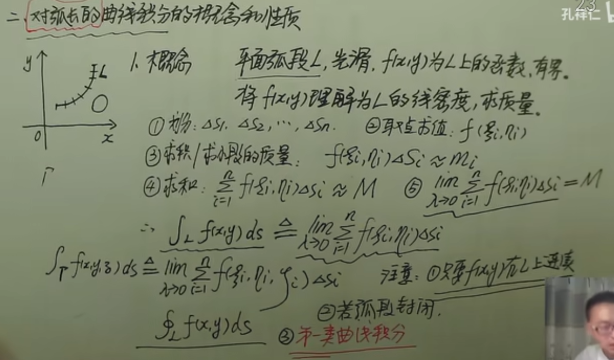
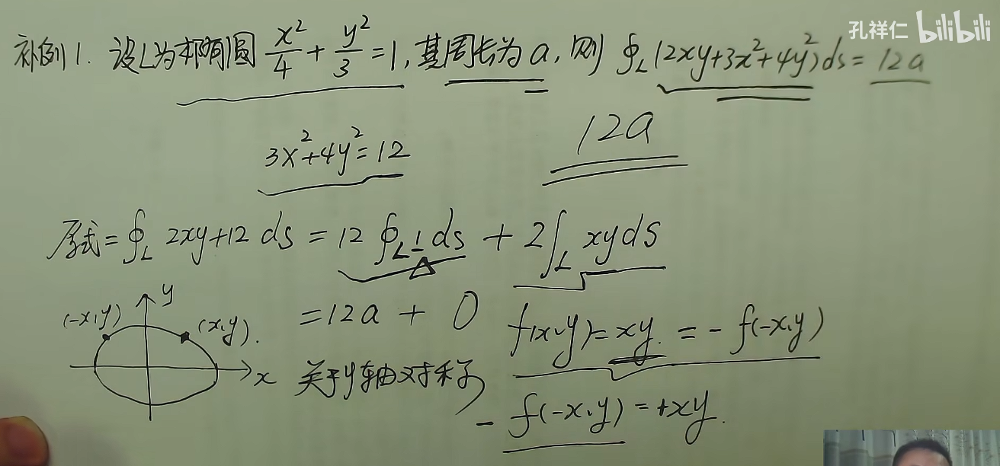
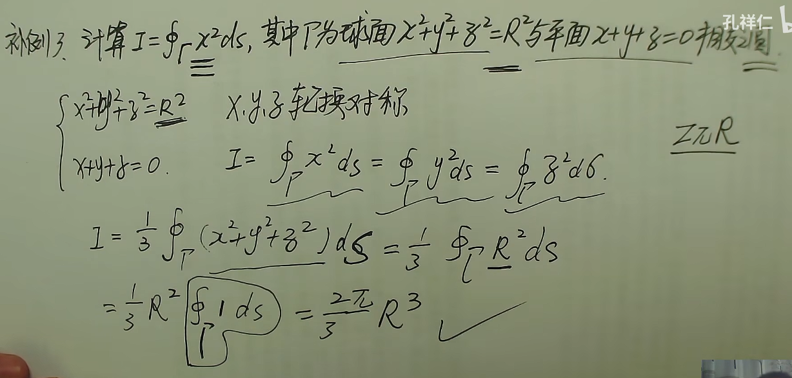
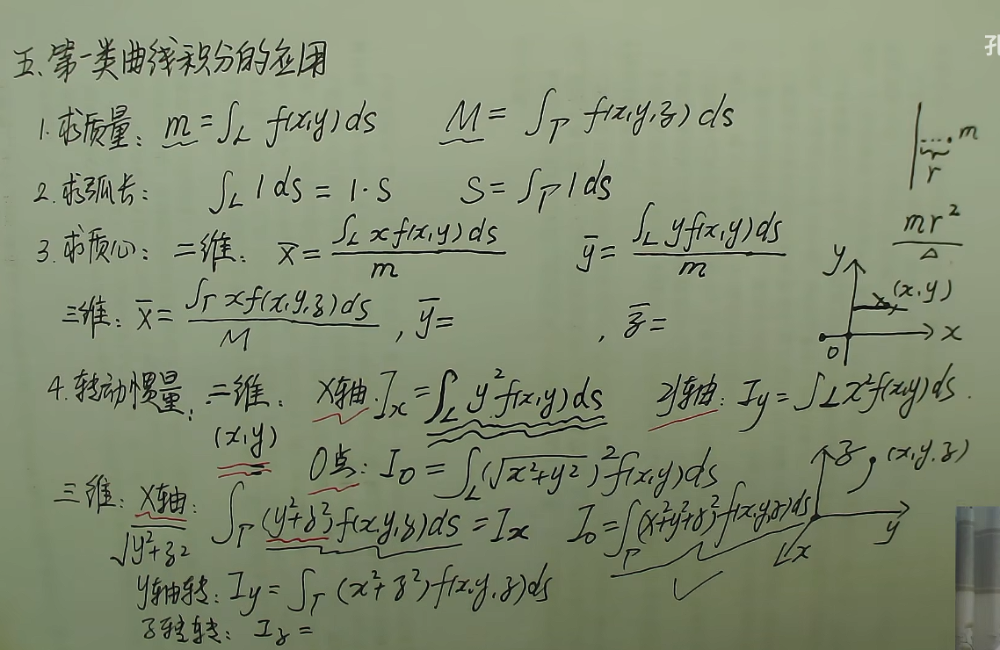

## 曲线积分

### 第一类曲线积分

#### 性质

设$\alpha,\beta$为常数则$\int_{L}[\alpha f(x,y)+\beta f(x,y)]ds=\alpha \int_{L}f(x,y)ds+\beta \int_{L}f(x,y)ds$

若积分弧段上可以分为光滑曲线弧$L_{1}$和$L_{2}$，则$\int_{L}f(x,y)ds=\int_{L_{1}}f(x,y)ds+\int_{L_{2}}f(x,y)ds$

若在$L$上，有$f(x,y)\leq g(x,y)$，则$\int_{L}f(x,y)ds\leq \int_{L}g(x,y)ds$

$|\int_{L}f(x,y)ds|\leq \int_{L}|f(x,y)|ds$

#### 计算方法

设$f(x,y)$在曲线弧$L$上有定义且连续，
##### 参数方程下
$L$的参数方程为
$$
L=\begin{cases}
	x=\phi (t) \\
	y=\psi (t)
\end{cases}
$$
若$\phi (t),\psi(t)在[\alpha,\beta]$上有一阶连续偏导数，且$(\phi'(t))^{2}+(\psi'(t))^{2} \neq_{0}$，则$\int_{L}f(x,y)ds$存在，且曲线积分为

$$
\int_{L}f(x,y)ds=\int_{\alpha}^{\beta}f(\phi(t),\psi(t))\cdot \sqrt{(\phi'(t))^2+(\psi'(t))^2}dt
$$
##### 直角坐标系下

$L$的方程为$y=y(x),a\leq x \leq b$，则

$$
\int_{L}f(x,y)ds=\int_{a}^{b}f(x,y(x))\cdot \sqrt{ x^{2}+y(x)^{2} }dt
$$

##### 极坐标系下

$L$的方程为$p=\rho (\theta),\alpha \leq x \leq \beta$，则
$$
\int_{L}f(x,y)ds=\int_{\alpha}^{\beta}f(\rho(\theta)\cos \theta,\rho(\theta)\sin \theta)\cdot \sqrt{\rho^2(\theta)+(\rho'(\theta))^2} d\theta
$$
##### 三维弧段的参数方程

空间曲线弧段的参数方程为

$$
\Gamma
\begin{cases}
	x=\phi(t) \\
	y=\psi(t) \\
	z=\omega (t)
\end{cases}
$$
其中$\alpha \leq x \leq \beta$，则
$$
\int_{\Gamma}f(x,y,z)ds=\int_{\alpha}^{\beta}f(\phi(t),\psi(t),\omega(t))\sqrt{ [\phi'(t)]^{2}+[\psi'(t)]^{2}+[\omega'(t)]^{2} }dt
$$

#### 利用对称性计算第一类曲线积分

二维弧段下，若弧线关于$y$轴对称
$$
\int_{L}f(x,y)ds=
\begin{cases}
	2\int_{L_{1}}f(x,y)ds & f(x,y)=f(-x,y) \\
	0 & f(x,y)=-f(-x,y)
\end{cases}
$$

若弧线关于x轴对称
$$
\int_{L}f(x,y)ds=
\begin{cases}
	2\int_{L_{1}}f(x,y)ds & f(x,y)=f(x,-y) \\
	0 & f(x,y)=-f(x,-y)
\end{cases}
$$

若为三维弧段的情况下，若弧段关于$yoz$平面对称

$$
\int_{\Gamma}f(x,y,z)ds=
\begin{cases}
	2\int_{\Gamma_{1}}f(x,y,z)ds & f(x,y,z)=f(-x,y,z) \\
	0 & f(x,y)=-f(-x,y,z)
\end{cases}
$$

#### 第一类曲线积分的应用

### 第二类曲线积分
#### 第二类曲线积分概念

$\vec{L}=F(x,y)$为$xoy$平面上的一段有向弧段，其中$f(x,y)=P(x,y)\vec{i}+Q(x,y)\vec{j},d\vec{r}=d\vec{x}+d\vec{y}$，则第二类曲线积分为
$$
\int_{\vec{L}}F(x,y)d\vec{r}=\int_{\vec{L}}P(x,y)dx+\int_{\vec{L}}Q(x,y)dy
$$
三维曲线的情况下则是$f(x,y,z)=P(x,y,z)\vec{i}+Q(x,y,z)\vec{j}+R(x,y,z)\vec{k},d\vec{r}=d\vec{x}+d\vec{y}+d\vec{z}$
$$
\int_{\vec{\Gamma}}F(x,y,z)d\vec{r}=\int_{\vec{\Gamma}}P(x,y,z)dx+\int_{\vec{\Gamma}}Q(x,y,z)dy+\int_{\Gamma}R(x,y,z)dz
$$
#### 第二类曲线积分的性质

设$\alpha,\beta$为常数则$\int_{L}[\alpha F(x,y)+\beta F(x,y)]dr=\alpha \int_{L}F(x,y)dr+\beta \int_{L}F(x,y)dr$

若积分弧段上可以分为光滑曲线弧$L_{1}$和$L_{2}$，则$\int_{L}F(x,y)dr=\int_{L_{1}}F(x,y)dr+\int_{L_{2}}F(x,y)dr$

设$L$为有向光滑曲线弧，$L^{-}$为$L$的反向曲线弧，则$\int_{L}F(x,y)dr=-\int_{L}F(x,y)dr$

#### 第二类曲线积分的计算

##### 参数方程式

二维弧段
$$
L:\begin{cases}
	x=\phi(t) \\
	y=\psi(t)
\end{cases}
(\alpha\leq t \leq \beta)
$$
当$t$单调地从$\alpha \to \beta$时，弧段上的点$M(x,y)$从起点$A\to$终点$B。\phi^{'}(t),\psi^{'}(t)$连续，且$[\phi^{'}(t)]^{2}+[\psi^{'}(t)]^{2}\neq 0,P(x,y),Q(x,y)$在$L$上与定义且连续，则
$$
\begin{align}
	\int_{L}P(x,y)dx=\int_{\alpha}^{\beta}P[\phi(t),\psi(t)]\phi^{'}(t)dt \\
	\int_{L}Q(x,y)dy=\int_{\alpha}^{\beta}Q[\phi(t),\psi(t)]\psi^{'}(t)dt
\end{align}
$$
起点为下限，终点为上限

##### 一般形式

$L:y=y(x) (a\leq x\leq b)$，当$x$单调地从$a \to b$时，弧段上的点$M(x,y)$从起点$A\to$终点$B$，则
$$
\begin{align}
	\int_{L}P(x,y)dx=\int_{a}^{b}P[x,y(x)]dx \\
	\int_{L}Q(x,y)dy=\int_{a}^{b}Q[x,y(x)]y^{'}(x)dx
\end{align}
$$

##### 极坐标系

$P=\rho(\theta),\alpha \leq \theta \leq \beta$，当$\theta$单调地从$\alpha \to \beta$时，弧段上的点$M(x,y)$从起点$A\to$终点$B$，则
$$
\begin{align}
	\int_{L}P(x,y)dx=\int_{\alpha}^{\beta}P[\rho(\theta)\cos \theta,\rho(\theta)\sin \theta]\cdot[\rho^{'}(\theta)\cos \theta-\rho(\theta)\sin \theta]d\theta \\
	\int_{L}Q(x,y)dy=\int_{\alpha}^{\beta}Q[\rho(\theta)\cos \theta,\rho(\theta)\sin \theta]\cdot[\rho^{'}(\theta)\sin \theta+\rho(\theta)\cos \theta]d\theta
\end{align}
$$

##### 三维弧段

$$
\Gamma=
\begin{cases}
	x=\phi(t) \\
	y=\psi(t) \\
	z=\omega(t)
\end{cases}
$$
当$t$单调地从$\alpha \to \beta$时，弧段上的点$M(x,y)$从起点$A\to$终点$B$，则

-------

$$
\begin{cases}
	\int_{\Gamma} P(x,y,z) dx = \int_{\alpha}^{\beta} P[\phi(t),\psi(t),\omega(t)] \phi^{'}(t) dt \\
	\int_{\Gamma} Q(x,y,z) dy = \int_{\alpha}^{\beta} Q[\phi(t),\psi(t),\omega(t)] \psi^{'}(t) dt \\
	\int_{\Gamma} R(x,y,z) dz = \int_{\alpha}^{\beta} R[\phi(t),\psi(t),\omega(t)] \omega^{'}(t) dt
\end{cases}
$$

## 曲面积分