## 曲线积分

### 第一类曲线积分

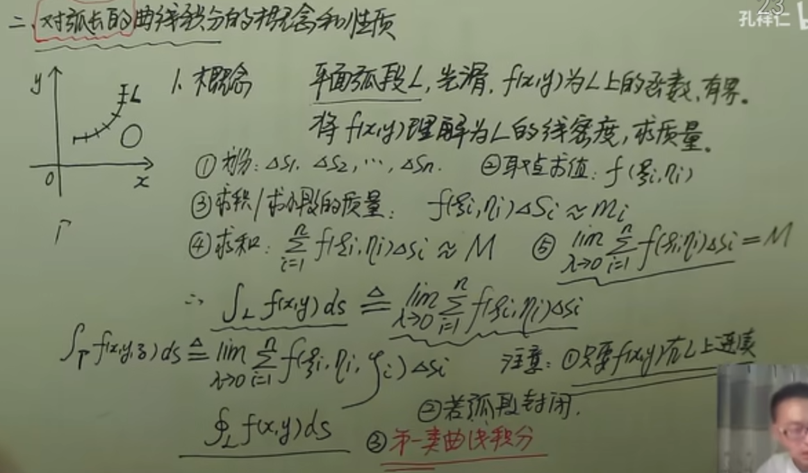
本质上是求曲线质量$\int_{L}f(x,y)ds$，$f(x,y)$为线密度，$ds$为弧微分，$L$为积分弧段
#### 性质

设$\alpha,\beta$为常数则$\int_{L}[\alpha f(x,y)+\beta f(x,y)]ds=\alpha \int_{L}f(x,y)ds+\beta \int_{L}f(x,y)ds$

若积分弧段上可以分为光滑曲线弧$L_{1}$和$L_{2}$，则$\int_{L}f(x,y)ds=\int_{L_{1}}f(x,y)ds+\int_{L_{2}}f(x,y)ds$

若在$L$上，有$f(x,y)\leq g(x,y)$，则$\int_{L}f(x,y)ds\leq \int_{L}g(x,y)ds$

$|\int_{L}f(x,y)ds|\leq \int_{L}|f(x,y)|ds$

#### 计算方法

参考定积分计算弧长部分，只是从$\int_{L}1dc$里面1变成了具体的线密度函数

设$f(x,y)$在曲线弧$L$上有定义且连续，
##### 参数方程下
$L$的参数方程为
$$
L=\begin{cases}
	x=\phi (t) \\
	y=\psi (t)
\end{cases}
$$
若$\phi (t),\psi(t)在[\alpha,\beta]$上有一阶连续偏导数，且$(\phi'(t))^{2}+(\psi'(t))^{2} \neq 0$，则$\int_{L}f(x,y)ds$存在，且曲线积分为

$$
\int_{L}f(x,y)ds=\int_{\alpha}^{\beta}f(\phi(t),\psi(t))\cdot \sqrt{(\phi'(t))^2+(\psi'(t))^2}dt
$$
##### 直角坐标系下

$L$的方程为$y=y(x),a\leq x \leq b$，则

$$
\int_{L}f(x,y)ds=\int_{a}^{b}f(x,y(x))\cdot \sqrt{ 1+(y'(x))^{2} }dx
$$

##### 极坐标系下

$L$的方程为$p=\rho (\theta),\alpha \leq x \leq \beta$，则
$$
\int_{L}f(x,y)ds=\int_{\alpha}^{\beta}f(\rho(\theta)\cos \theta,\rho(\theta)\sin \theta)\cdot \sqrt{\rho^2(\theta)+(\rho'(\theta))^2} d\theta
$$
##### 三维弧段的参数方程

空间曲线弧段的参数方程为

$$
\Gamma
\begin{cases}
	x=\phi(t) \\
	y=\psi(t) \\
	z=\omega (t)
\end{cases}
$$
其中$\alpha \leq x \leq \beta$，则
$$
\int_{\Gamma}f(x,y,z)ds=\int_{\alpha}^{\beta}f(\phi(t),\psi(t),\omega(t))\sqrt{ [\phi'(t)]^{2}+[\psi'(t)]^{2}+[\omega'(t)]^{2} }dt
$$

#### 利用对称性计算第一类曲线积分

二维弧段下，若弧线关于$y$轴对称
$$
\int_{L}f(x,y)ds=
\begin{cases}
	2\int_{L_{1}}f(x,y)ds & f(x,y)=f(-x,y) \\
	0 & f(x,y)=-f(-x,y)
\end{cases}
$$

若弧线关于x轴对称
$$
\int_{L}f(x,y)ds=
\begin{cases}
	2\int_{L_{1}}f(x,y)ds & f(x,y)=f(x,-y) \\
	0 & f(x,y)=-f(x,-y)
\end{cases}
$$

若为三维弧段的情况下，若弧段关于$yoz$平面对称

$$
\int_{\Gamma}f(x,y,z)ds=
\begin{cases}
	2\int_{\Gamma_{1}}f(x,y,z)ds & f(x,y,z)=f(-x,y,z) \\
	0 & f(x,y)=-f(-x,y,z)
\end{cases}
$$

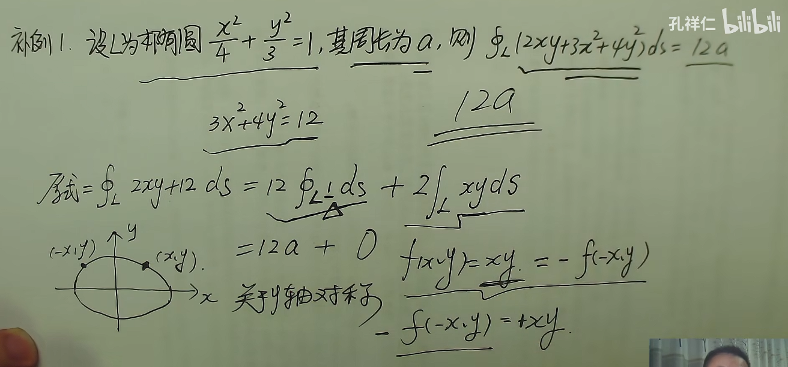

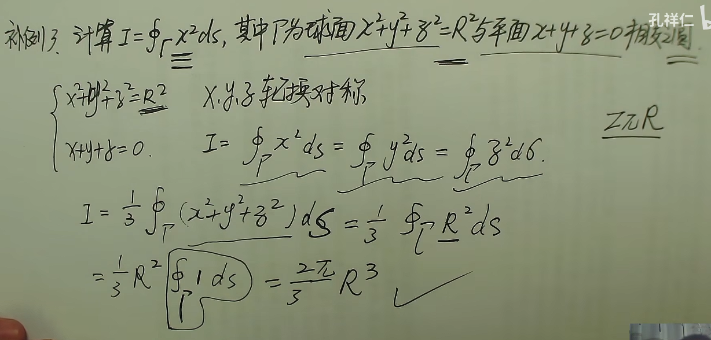
$x,y,z$交换，式子完全成立，相交曲线为最大圆
#### 第一类曲线积分的应用

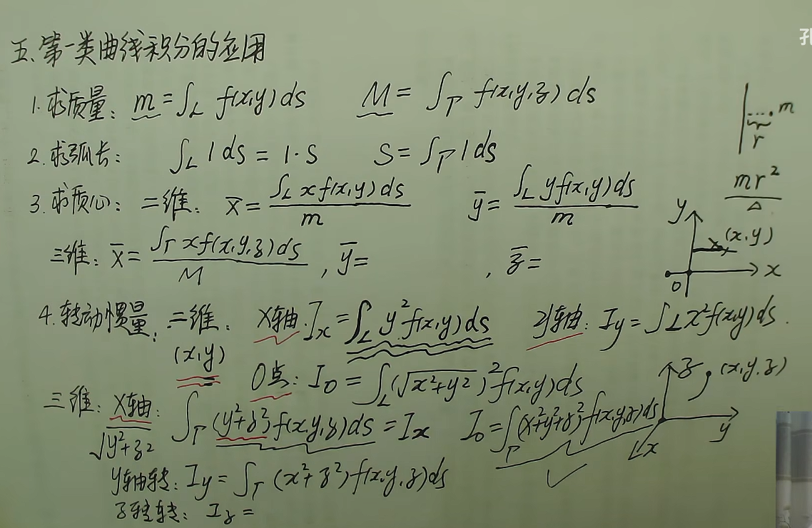

### 第二类曲线积分
#### 第二类曲线积分概念

$\vec{L}=F(x,y)$为$xoy$平面上的一段有向弧段，其中$f(x,y)=P(x,y)\vec{i}+Q(x,y)\vec{j},d\vec{r}=d\vec{x}+d\vec{y}$，则第二类曲线积分为
$$
\int_{\vec{L}}F(x,y)d\vec{r}=\int_{\vec{L}}P(x,y)dx+\int_{\vec{L}}Q(x,y)dy
$$
三维曲线的情况下则是$f(x,y,z)=P(x,y,z)\vec{i}+Q(x,y,z)\vec{j}+R(x,y,z)\vec{k},d\vec{r}=d\vec{x}+d\vec{y}+d\vec{z}$
$$
\int_{\vec{\Gamma}}F(x,y,z)d\vec{r}=\int_{\vec{\Gamma}}P(x,y,z)dx+\int_{\vec{\Gamma}}Q(x,y,z)dy+\int_{\Gamma}R(x,y,z)dz
$$
#### 第二类曲线积分的性质

设$\alpha,\beta$为常数则$\int_{L}[\alpha F(x,y)+\beta F(x,y)]dr=\alpha \int_{L}F(x,y)dr+\beta \int_{L}F(x,y)dr$

若积分弧段上可以分为光滑曲线弧$L_{1}$和$L_{2}$，则$\int_{L}F(x,y)dr=\int_{L_{1}}F(x,y)dr+\int_{L_{2}}F(x,y)dr$

设$L$为有向光滑曲线弧，$L^{-}$为$L$的反向曲线弧，则$\int_{L}F(x,y)dr=-\int_{L}F(x,y)dr$

#### 第二类曲线积分的计算

##### 参数方程式

二维弧段
$$
L:\begin{cases}
	x=\phi(t) \\
	y=\psi(t)
\end{cases}
(\alpha\leq t \leq \beta)
$$
当$t$单调地从$\alpha \to \beta$时，弧段上的点$M(x,y)$从起点$A\to$终点$B。\phi^{'}(t),\psi^{'}(t)$连续，且$[\phi^{'}(t)]^{2}+[\psi^{'}(t)]^{2}\neq 0,P(x,y),Q(x,y)$在$L$上与定义且连续，则
$$
\begin{align}
	\int_{L}P(x,y)dx=\int_{\alpha}^{\beta}P[\phi(t),\psi(t)]\phi^{'}(t)dt \\
	\int_{L}Q(x,y)dy=\int_{\alpha}^{\beta}Q[\phi(t),\psi(t)]\psi^{'}(t)dt
\end{align}
$$
起点为下限，终点为上限

##### 一般形式

$L:y=y(x) (a\leq x\leq b)$，当$x$单调地从$a \to b$时，弧段上的点$M(x,y)$从起点$A\to$终点$B$，则
$$
\begin{align}
	\int_{L}P(x,y)dx=\int_{a}^{b}P[x,y(x)]dx \\
	\int_{L}Q(x,y)dy=\int_{a}^{b}Q[x,y(x)]y^{'}(x)dx
\end{align}
$$

##### 极坐标系

$P=\rho(\theta),\alpha \leq \theta \leq \beta$，当$\theta$单调地从$\alpha \to \beta$时，弧段上的点$M(x,y)$从起点$A\to$终点$B$，则
$$
\begin{align}
	\int_{L}P(x,y)dx=\int_{\alpha}^{\beta}P[\rho(\theta)\cos \theta,\rho(\theta)\sin \theta]\cdot[\rho^{'}(\theta)\cos \theta-\rho(\theta)\sin \theta]d\theta \\
	\int_{L}Q(x,y)dy=\int_{\alpha}^{\beta}Q[\rho(\theta)\cos \theta,\rho(\theta)\sin \theta]\cdot[\rho^{'}(\theta)\sin \theta+\rho(\theta)\cos \theta]d\theta
\end{align}
$$

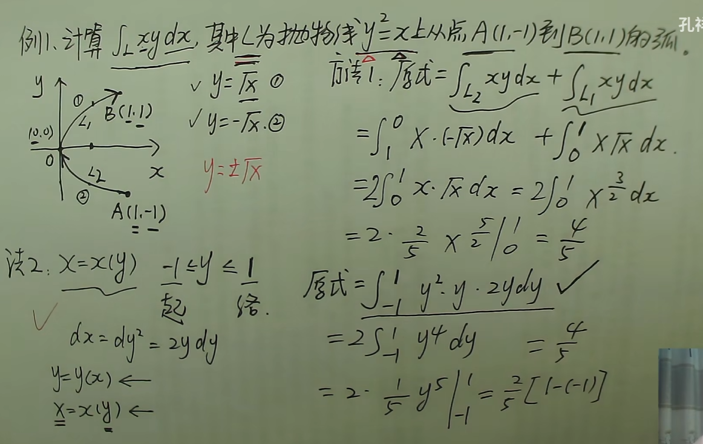
##### 三维弧段

$$
\Gamma=
\begin{cases}
	x=\phi(t) \\
	y=\psi(t) \\
	z=\omega(t)
\end{cases}
$$
当$t$单调地从$\alpha \to \beta$时，弧段上的点$M(x,y)$从起点$A\to$终点$B$，则

-------

$$
\begin{cases}
	\int_{\Gamma} P(x,y,z) dx = \int_{\alpha}^{\beta} P[\phi(t),\psi(t),\omega(t)] \phi^{'}(t) dt \\
	\int_{\Gamma} Q(x,y,z) dy = \int_{\alpha}^{\beta} Q[\phi(t),\psi(t),\omega(t)] \psi^{'}(t) dt \\
	\int_{\Gamma} R(x,y,z) dz = \int_{\alpha}^{\beta} R[\phi(t),\psi(t),\omega(t)] \omega^{'}(t) dt
\end{cases}
$$
#### 格林公式

将第二类曲线积分转为二重积分进行计算

单连通区域：在一个区域内任意做一条闭合曲线，这条曲线内的元素都属于该区域，圆形
复连通区域：在一个区域内任意做一条闭合曲线，这条曲线内的元素不全属于该区域，圆环

边界曲线的正方向，边界曲线上的点沿着正方向运动，左侧为区域内元素，因此复连通区域内外正方向相反

设闭区域$D$有分段光滑曲线$L$围成，若$P(x,y)$和$Q(x,y)$在$D$上有一阶连续偏导数，则
$$
\oint_{L}P(x,y)dx+Q(x,y)dy=\iint_{D} \frac{\partial Q}{\partial x}-\frac{\partial P}{\partial y}dxdy
$$
其中$L$为$D$取正方向的边界曲线

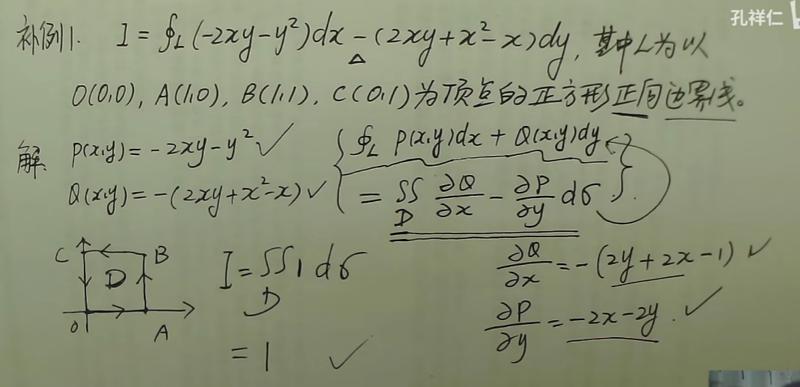

注意当在$D$上某些区域没有定义的时候，需要将其拆出来进行处理

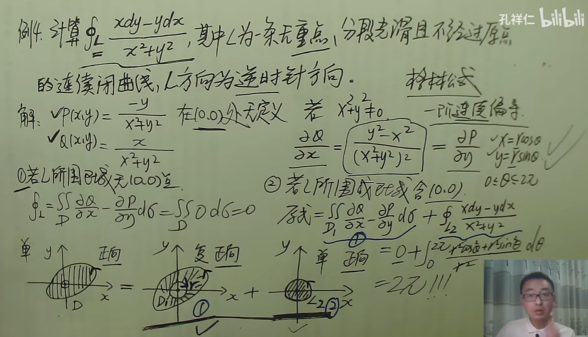

当要求一个二重积分不太好求的时候，不妨试试将其转换为第二类曲线积分

$$
\iint_{D}1d\sigma=\frac{1}{2}\oint-ydx+xdy
$$

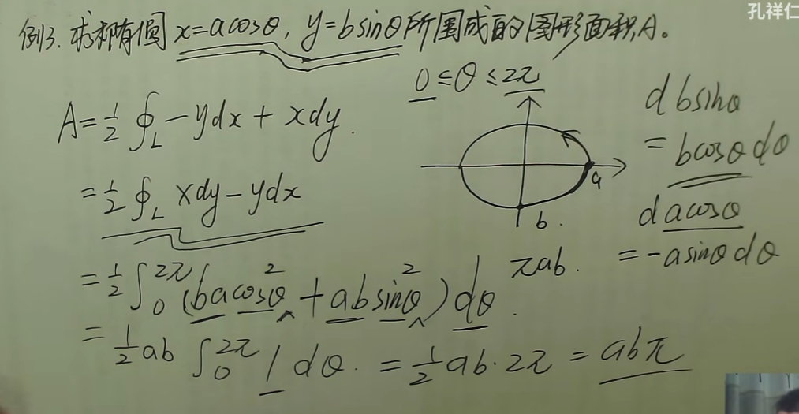

## 曲面积分

### 第一类曲面积分

类比第一类曲线积分，求三维空间中曲面的质量，$\iint \limits_{\Sigma}f(x,y,z)dS$，$f(x,y,z)$为面密度，$dS$为体微分，$\Sigma$为积分曲面

#### 性质

$$
\iint \limits_{\Sigma}[\alpha f(x,y,z)+\beta f(x,y,z)]dS=\alpha\iint\limits_{\Sigma} f(x,y,z)dS+\beta\iint\limits_{\Sigma} f(x,y,z)dS
$$

若分片光滑区域$\Sigma$，可分为两片分片光滑区域$\Sigma_{1}$和$\Sigma_{2}$

$$
\iint \limits_{\Sigma}f(x,y,z)dS=\iint \limits_{\Sigma_{1}}f(x,y,z)dS+\iint \limits_{\Sigma_{2}}f(x,y,z)dS
$$

若在$\Sigma$上$f(x,y,z)\leq g(x,y,z)$
$$
\iint \limits_{\Sigma}f(x,y,z)dS\leq\iint \limits_{\Sigma}g(x,y,z)dS
$$
特别的
$$
|\iint \limits_{\Sigma}f(x,y,z)dS|\leq\iint \limits_{\Sigma}|f(x,y,z)|dS
$$

#### 第一类曲线积分计算方法

有$z=z(x,y)$，则利用平面在$XOY$平面上的投影$D_{xy}$
$$
\iint \limits_{\Sigma}f(x,y,z)dS=\iint \limits_{D_{xy}}f(x,y,z(x,y))\sqrt{ 1+(z_{x}^{'})^{2}+(z_{y}^{'})^{2} }d\sigma
$$

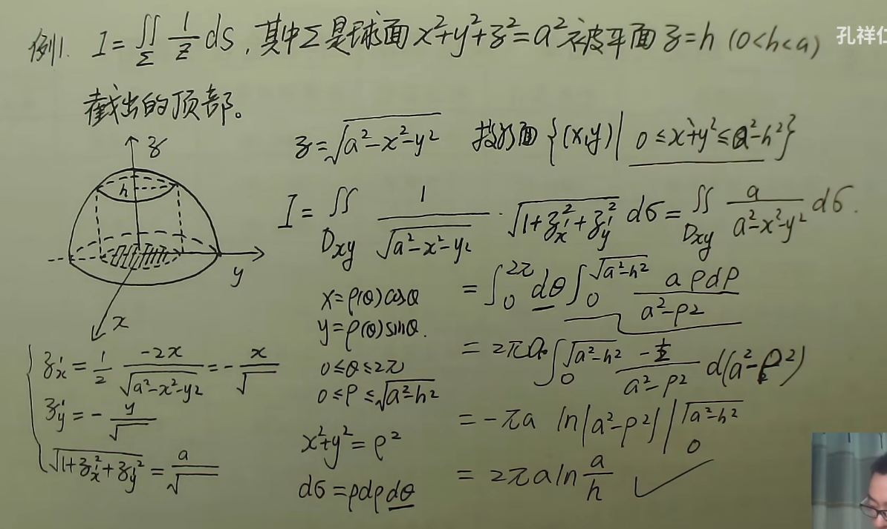

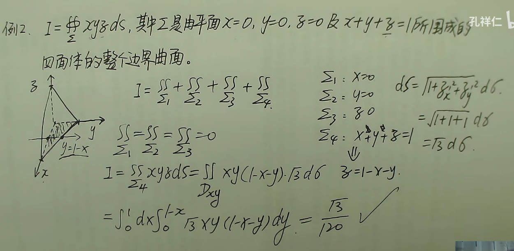

#### 第一类曲面积分的应用

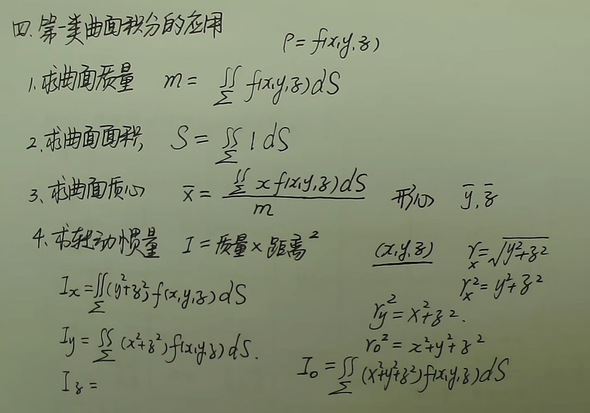
看到积分区域为球面的时候，考虑使用轮换对称性去带掉$f(x,y,z)$

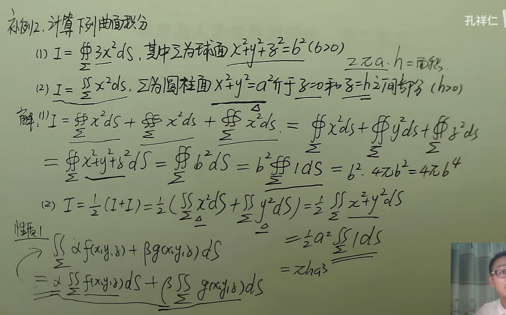

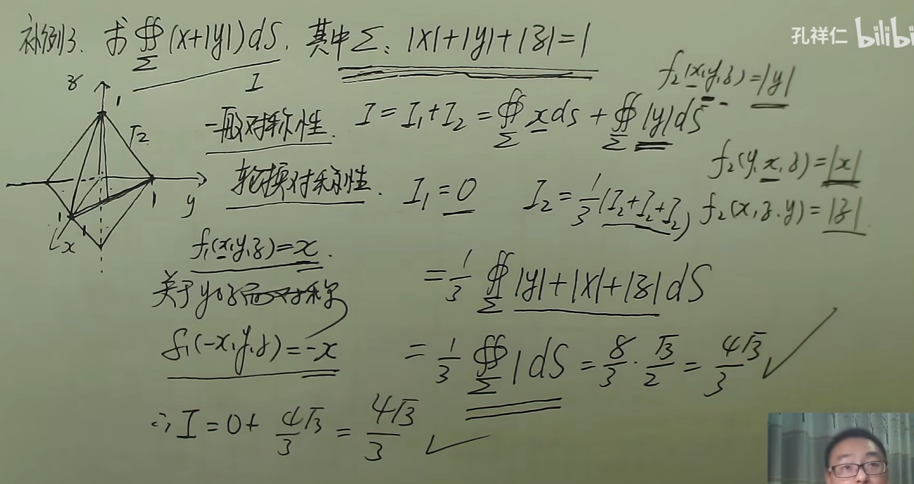

### 第二类曲面积分

一个曲面有两个面，用曲面的法向量来描述这个曲面的方向

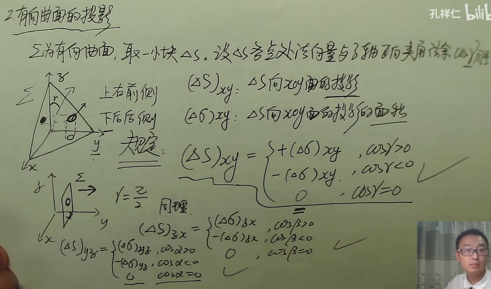

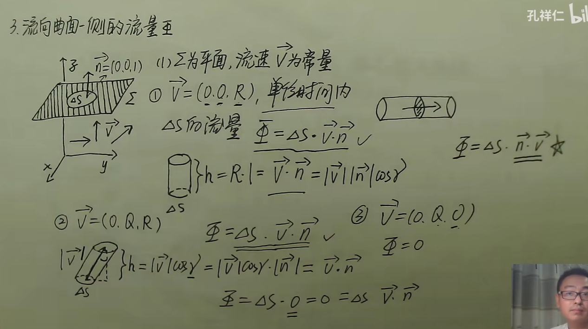
也可以理解为磁通量
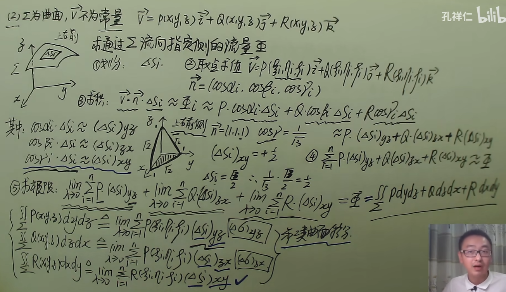
$\Sigma=f(x,y,z)=0$为三维的一个曲面，在该曲面范围内有$F(x,y，z)=P(x,y,z)\vec{i}+Q(x,y,z)\vec{j}+R(x,y,z)\vec{k}$，则第二类曲线积分为
$$
\int \limits_{\Sigma}F(x,y,z)dS=\iint\limits_{D_{yz}}Pdydz+\iint\limits_{D_{xz}}Qdxdz+\iint\limits_{D_{xy}}Rdxdy
$$

#### 性质

积分区域可拆

$$
\iint\limits_{\Sigma}=\iint\limits_{\Sigma_{1}}+\iint\limits_{\Sigma_{2}}
$$

$\Sigma$为有向曲面，$\Sigma^{-}$为反向的有向曲面

$$
\iint\limits_{\Sigma}=\phi ,\iint\limits_{\Sigma^{-}}=-\phi
$$

#### 第二类曲面积分的计算

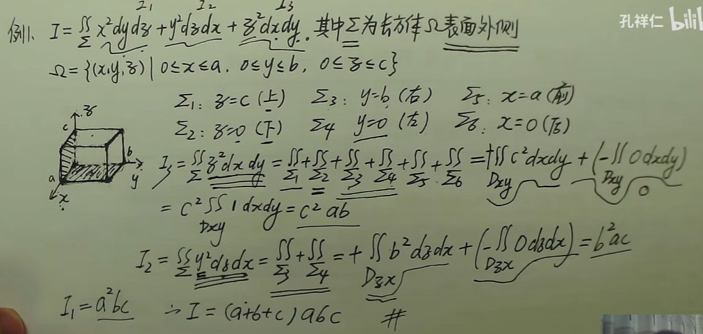

由上面的第二类曲面积分的推导中，方向余弦乘$dS$空间微分为平面微分$d\sigma$，因此当第一类曲面积分的被积函数中出现方向余弦也就是一部分的第二类曲面积分

换句话说，第一类和第二类的曲面积分一定程度上是互通的，可以将$dydz$的第二类曲面积分转为第一类后再转为第二类的$dxdy$的曲面积分
