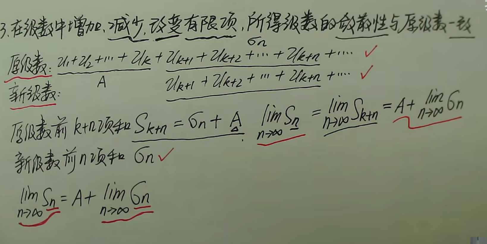
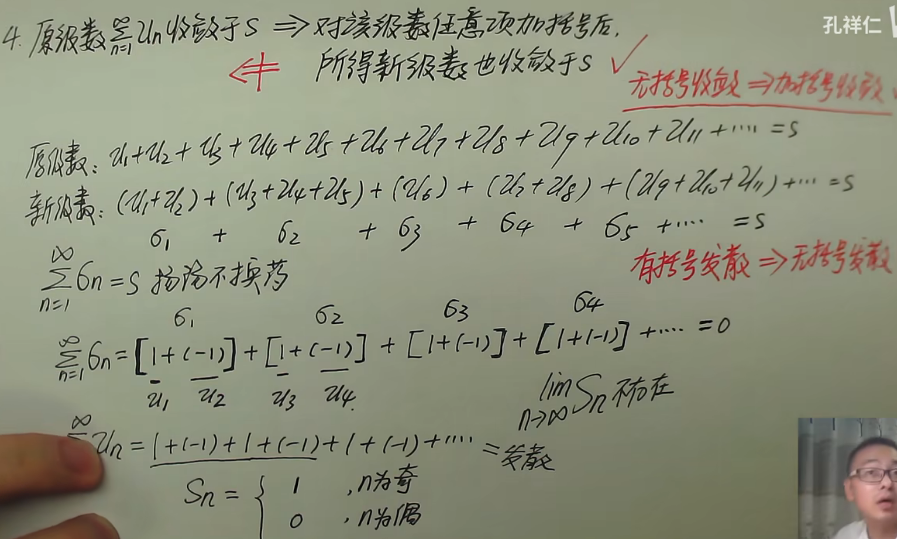
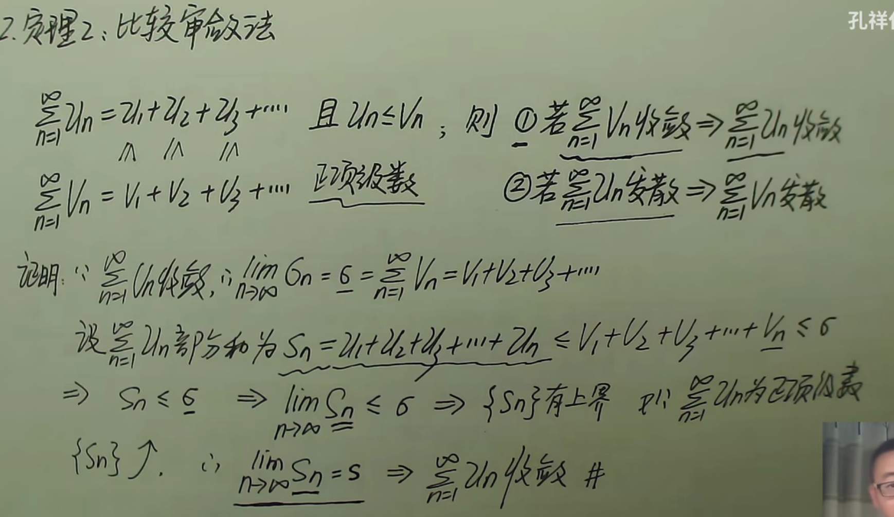
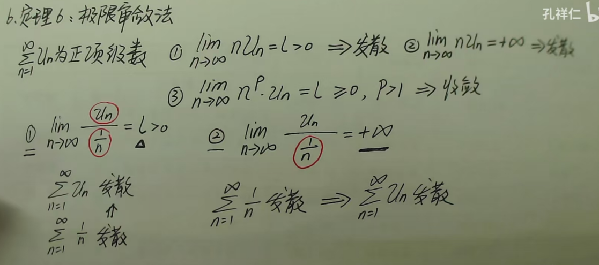

## 常数项级数

数列$\{\mu_{n}\}=\{\mu_{1},\mu_{2},\dots,\mu_{n}\}$，无穷级数$\sum_{n=1}^{\infty}\mu_{n}$

数列的前$n$项和$S_{n}=u_{1}+u_{2}+\dots u_{n}$，部分和数列$\{ S_{n}\},\text{其中}S_{1}=u_{1},s_{n}=\sum_{i=1}^{n}u_{i}$

数列的部分和数列的极限就是常数项无穷级数的值：
- 若$\lim_{ n \to \infty }S_{n}=s$存在，则部分和数列收敛$\Leftrightarrow$常数项无穷收敛于$s$

几何级数：等比数列和$S_{n}=a+aq+aq^{2}+\dots+aq^{n}=\frac{a(1-q^{n})}{1-q}$， 
- $|q|<1$：$\lim_{ n \to \infty }S_{n}=\frac{a}{1-q}$级数收敛
- $|q|>1$：$\lim_{ n \to \infty }S_{n}$不存在，级数发散

调和级数$\sum_{n=1}^{\infty} \frac{1}{n}$发散，$\sum_{n=1}^{\infty} \frac{1}{n^{p}}，当p \leq 1时发散，p>1时收敛$

P级数$\sum_{n=1}^{\infty} \frac{1}{n^{P}}，当P>1$，P级数收敛
### 级数的性质

- $\sum_{n=1}^{\infty}\mu_{n}$收敛于$S\to \sum_{n=1}^{\infty}k\mu_{n}$收敛于$kS$
- 若$\sum_{n=1}^{\infty}\mu_{n}$发散，且$k=0\to \sum_{n=1}^{\infty}k\mu_{n}$收敛于0
- 若$\sum_{n=1}^{\infty}\mu_{n}$发散，且$k\neq0\to \sum_{n=1}^{\infty}k\mu_{n}$发散

有级数$A=\sum_{n=1}^{\infty}\mu_{n},B=\sum_{n=1}^{\infty}\sigma_{n}$,有
- A收敛于S，B收敛于$\sigma \to \sum_{n=1}^{\infty}(\mu_{n} \pm \sigma_{n})$收敛
- 收敛$\pm$发散$\to$发散
- 发散$\pm$发散$\to$未知

>逆命题不成立,加括号可能“掩盖震荡”,原来是在不断左右横跳,每两项打包,震荡直接被局部抵消。

若$\sum_{n=1}^{\infty}\mu_{n}$收敛于$S \to \\lim_{ n \to \infty }\mu_{n}=0$
### 正项级数
级数中的每一项都为正数

#### 定理一

当$\mu_{n}\geq 0$时，$\sum_{n=0}^{\infty}\mu_{n}$为正项级数，$\{S_{n}\}$有界$\Leftrightarrow$级数收敛，即$\lim_{ n \to \infty }Sn=S \Leftrightarrow$级数收敛，反之$\lim_{ n \to \infty }S_{n}不存在 \Leftrightarrow$级数发散

#### 定理二 比较审敛法

推论：

- $\exists N >0,当n\geq N时，有\mu_{n}\leq kV_{n}，当\sum_{n=1}^{\infty}V_{n}收敛，则\sum_{n=1}^{\infty}收敛$
-  $\exists N >0,当n\geq N时，有\mu_{n}\geq kV_{n}，当\sum_{n=1}^{\infty}V_{n}发散，则\sum_{n=1}^{\infty}发散$

大的收敛，小的也收敛；小的发散，大的也发散

#### 定理三 比较审敛法极限形式
$$
\lim_{ n \to \infty } \frac{\mu_{n}}{v_{n}}=L>0
$$

- 或$L=0，且\sum_{n=1}^{\infty}v_{n}收敛，则\sum_{n=1}^{\infty}\mu_{n}收敛$
- 或$L=\infty，且\\um_{n=1}^{\infty}v_{n}发散，则\sum_{n=1}^{\infty}\mu_{n}发散$
总结分析
1. $0<L<\infty,\sum_{n=1}^{\infty}v_{n}与\sum_{n=1}^{\infty}\mu_{n}敛散性一致$
2. $L=0,\sum_{n=1}^{\infty}v_{n}收敛 \to \sum_{n=1}^{\infty}\mu_{n}收敛$
3. $L=\infty,\sum_{n=1}^{\infty}v_{n}发散 \to \sum_{n=1}^{\infty}\mu_{n}发散$

本质还是大的收敛，小的也收敛；小的发散，大的也发散

#### 定理六 极限审敛法

本质还是将式子换为分式来判断级数敛散性

#### 定理四 比值审敛法

正项级数$\sum_{n=1}^{\infty}\mu_{n}$,有$\lim_{ n \to \infty } \frac{\mu_{n+1}}{\mu_{n}}=p \geq 0$，有如下定理
- 当$p<1$时，级数收敛
- 当$p>1$时，级数发散
- 当$p=1$时，无法判断
- 当$p=+\infty$时，级数发散

当n趋向于无穷的时候，后一项仍是前一项的一倍以上的时候，那说明累加和仍在增大或减小
#### 定理五 根值审敛法、柯西审敛法

正项级数$\sum_{n=1}^{\infty}\mu_{n}$,有$\lim_{ n \to \infty } \mu_{n}^{ \frac{1}{n} }=p \geq 0$，有如下定理

- 当$p<1$时，级数收敛
- 当$p>1$时，级数发散
- 当$p=1$时，无法判断
- 当$p=+\infty$时，级数发散

### 交错级数

在正项级数的基础上，对正项和负项交替进行求和，即$\mu_{1}-\mu_{2}+\mu_{3}-\mu_{4}+\dots=\sum_{n=1}^{\infty}(-1)^{n-1}\mu_{n}$或$-\mu_{1}+\mu_{2}-\mu_{3}+\mu_{4}-\dots=\sum_{n=1}^{\infty}(-1)^{n}\mu_{n}$

#### 定理七 莱布尼兹定理

若级数$\sum_{n=1}^{\infty}(-1)^{n-1}\mu_{n}$满足$\mu_{n}\geq \mu_{n+1},\lim_{ n \to \infty }\mu_{n}=0$，则级数收敛且$\sum_{n=1}^{\infty}(-1)^{n-1}\mu_{n}=s<\mu_{1},|r_{n}|=|\mu_{n+1}-\mu_{n+2}+\mu_{n+3}-\mu_{n+4}+\dots|\leq \mu_{n+1}$

## 函数项级数

### 幂级数

### 三角级数/傅里叶展开

## 级数性质

$$
A=\sum ^{\infty}_{n=1}\mu_n,B=\sum ^{\infty}_{n=1}k\mu_n
$$

则

- $A收敛于s\to B收敛于ks$
- $A发散且k=0 \to B收敛于0$
- $A发散且k!=0 \to B发散$
- 收敛±收敛=收敛，收敛±发散=发散，发散±发散=未知

在级数中增加，减少，改变有限项，所得级数的敛散性与原级数一致

原级数$\sum^{\infty}_{n=1}$收敛于S$\to$对该级数任意项加括号后，所得新级数也收敛于S

若$\sum^{\infty}_{n=1}$收敛于S$\to lim_{n \to \infty}\mu_n=0$

调和级数：发散
$$
\mu_n=1+\frac{1}{2}+\frac{1}{3}+...+\frac{1}{n}+...
$$
## 正项级数审敛法
$$

$$