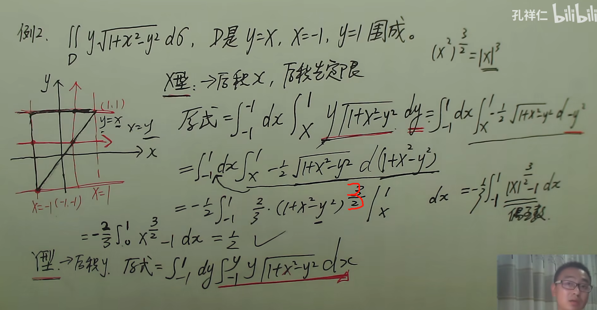
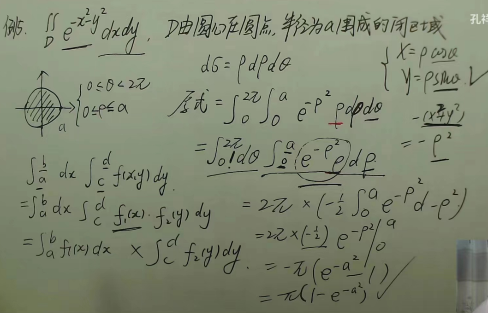
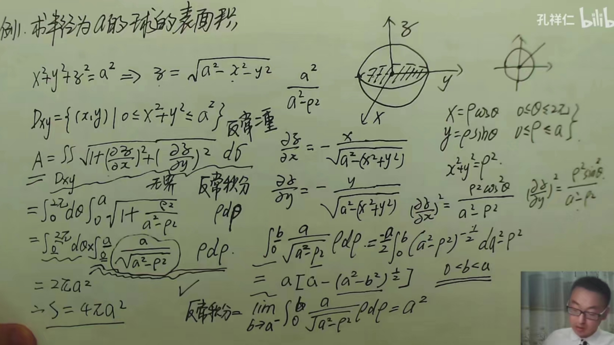

## 二重积分的性质

设函数 $f(x,y)$、$g(x,y)$ 在闭区域 $D$ 上可积，$D$ 的面积为 $\sigma$。

二重积分常用性质如下：

1. 线性性质：

$$
\iint_D [\alpha f+\beta g]\,d\sigma
=
\alpha\iint_D f\,d\sigma
+
\beta\iint_D g\,d\sigma
$$

2. 区域可加性：

$$
\iint_D f\,d\sigma
=
\iint_{D_1} f\,d\sigma
+
\iint_{D_2} f\,d\sigma
$$

3. 常数函数积分：

$$
\iint_D 1\,d\sigma=\sigma
$$

4. 保序性：

$$
f\leq g
\Rightarrow
\iint_D f\,d\sigma
\leq
\iint_D g\,d\sigma
$$

5. 绝对值不等式：

$$
\left|\iint_D f\,d\sigma\right|
\leq
\iint_D |f|\,d\sigma
$$

6. 估值性质：

$$
m\sigma
\leq
\iint_D f\,d\sigma
\leq
M\sigma
$$

7. 中值定理：

$$
\iint_D f(x,y)\,d\sigma
=
f(\xi,\eta)\sigma
$$

---

### 1. 线性性质

若 $\alpha,\beta$ 为常数，则

$$
\iint_D [\alpha f(x,y)+\beta g(x,y)]\,d\sigma
=
\alpha \iint_D f(x,y)\,d\sigma
+
\beta \iint_D g(x,y)\,d\sigma
$$

也就是说，二重积分可以拆开来计算，常数可以提到积分号外面。

---

### 2. 区域可加性

如果积分区域 $D$ 可以分成两个不重叠的小区域：

$$
D = D_1 \cup D_2
$$

且 $D_1$ 与 $D_2$ 除边界外没有公共内部点，则

$$
\iint_D f(x,y)\,d\sigma
=
\iint_{D_1} f(x,y)\,d\sigma
+
\iint_{D_2} f(x,y)\,d\sigma
$$

也就是说，把区域拆成几部分，整体积分等于各部分积分之和。

---

### 3. 常数函数的二重积分

若在区域 $D$ 上，

$$
f(x,y) \equiv 1
$$

则

$$
\iint_D 1\,d\sigma = \sigma
$$

其中 $\sigma$ 表示区域 $D$ 的面积。

更一般地，如果 $f(x,y)\equiv C$，则

$$
\iint_D C\,d\sigma = C\sigma
$$

---

### 4. 保序性

若在区域 $D$ 上恒有

$$
f(x,y) \leq g(x,y)
$$

则

$$
\iint_D f(x,y)\,d\sigma
\leq
\iint_D g(x,y)\,d\sigma
$$

也就是说，函数值越大，在同一区域上的二重积分也越大。

---

### 5. 绝对值不等式

对于可积函数 $f(x,y)$，有

$$
\left|\iint_D f(x,y)\,d\sigma\right|
\leq
\iint_D |f(x,y)|\,d\sigma
$$

---

### 6. 估值性质

设 $f(x,y)$ 在区域 $D$ 上有最大值 $M$ 和最小值 $m$，即

$$
m \leq f(x,y) \leq M
$$

又设区域 $D$ 的面积为 $\sigma$，则

$$
m\sigma
\leq
\iint_D f(x,y)\,d\sigma
\leq
M\sigma
$$

---

### 7. 二重积分中值定理

若 $z=f(x,y)$ 在闭区域 $D$ 上连续，且 $D$ 的面积为 $\sigma$，则至少存在一点

$$
(\xi,\eta)\in D
$$

使得

$$
\iint_D f(x,y)\,d\sigma
=
f(\xi,\eta)\sigma
$$

也可以写成：

$$
f(\xi,\eta)
=
\frac{1}{\sigma}
\iint_D f(x,y)\,d\sigma
$$

其中

$$
\frac{1}{\sigma}
\iint_D f(x,y)\,d\sigma
$$

表示函数 $f(x,y)$ 在区域 $D$ 上的平均值。

如果函数 $f(x,y)$ 在区域 $D$ 上连续，那么它在区域 $D$ 上的平均高度一定等于区域内某一点的函数值。

也就是说，存在某个点 $(\xi,\eta)$，使得：

$$
\text{平均高度} = f(\xi,\eta)
$$

因此：

$$
\text{体积} = \text{底面积} \times \text{某一点的高度}
$$

即：

$$
\iint_D f(x,y)\,d\sigma
=
f(\xi,\eta)\sigma
$$

---

## 二重积分的计算

### 求平行截面面积已知的立体的体积

####  $X$ 型区域

如果区域 $D$ 可以表示为：

$$
D:
\begin{cases}
a\le x\le b \\
\varphi_1(x)\le y\le \varphi_2(x)
\end{cases}
$$

则称 $D$ 为 $X$ 型区域。

> 先确定 $x$ 的范围，再用 $x$ 表示 $y$ 的上下边界。

对应的二重积分为：

$$
\iint_D f(x,y)\,d\sigma
=
\int_a^b dx
\int_{\varphi_1(x)}^{\varphi_2(x)}
f(x,y)\,dy
$$

####  $Y$ 型区域

如果区域 $D$ 可以表示为：
$$
D:
\begin{cases}
c\le y\le d \\
\psi_1(y)\le x\le \psi_2(y)
\end{cases}
$$

则称 $D$ 为 $Y$ 型区域。

> 先确定 $y$ 的范围，再用 $y$ 表示 $x$ 的左右边界。

对应的二重积分为：

$$
\iint_D f(x,y)\,d\sigma
=
\int_c^d dy
\int_{\psi_1(y)}^{\psi_2(y)}
f(x,y)\,dx
$$

若$D$为矩形区域，且$f(x,y)=f_1(x)\cdot f_2(y)$，则
$$
\int\int_Df(x,y)d\delta=\int_a^bf_1(x)dx\cdot\int_c^df_2(y)dy
$$
当对$x/y$进行积分不好算的时候，可以先又式子推出范围，再根据范围先对$y/x$进行积分
## 极坐标表示二重积分

### 极坐标表示区域

#### 极坐标表示点

$$
\begin{cases}
\theta=\frac{\pi}{2}\\
\rho=\sqrt{2}
\end{cases}
$$

#### 极坐标表示线

$$
\begin{cases}
0\leq\theta \leq \frac{\pi}{2}\\
\rho=2rcos \theta
\end{cases}
$$

#### 极坐标表示面

$$
\begin{cases}
0\leq\theta \leq \frac{\pi}{2}\\
0<\rho\leq2rcos \theta
\end{cases}
$$

增长的面积微分为：
$$
d_{\sigma}=\rho d_{\rho}d_{\theta}
$$

$$
\int \int_D e^{-x^2-y^2}d_{\sigma}=\pi(1-e^{-a^2})
$$
因此对于无法找到初等原函数的式子，如高斯积分，可以将其升维为二重积分，二重积分的结果就是原值的平方。
$$
\int_0^Re^{-x^2}dx\cdot \int_0^Re^{-y^2}dy=\int \int_D e^{-(x^2+y^2)}d_{\sigma}=\pi(1-e^{-R^2})
$$
∵$R->\infty$,所以原式$=\pi$,因此
$$
\begin{cases}
\int^{+\infty}_{-\infty}e^{-x^2}dx=\sqrt{\pi}\\
\int^{+\infty}_{0}e^{-x^2}dx=\frac{\sqrt{\pi}}{2}
\end{cases}
$$
### 对称性
当积分区域出现对称性时，考虑轮换对称性以及被积函数在这区域上的对称性来简化运算

## 三重积分
### 求空间曲面面积
$z=f(x,y)$是曲面，在$D_{xy}$上有连续偏导，则面积
$$
A=\int\int_{D_{xy}}\sqrt{1+(\frac{\partial z}{\partial x})^2+(\frac{\partial z}{\partial y})^2}dxdy
$$
同理，极坐标系下只需要将$dxdy$替换为$d\sigma=\rho d\rho \theta$即可

若$z=g(x,y)$,则

$$
\int \int_{\sum}f(x,y,z)d \sigma=\int \int _{\sum} f(x,y,g(x,y))\sqrt{1+(\frac{\partial z}{\partial x})^2+(\frac{\partial z}{\partial y})^2}dxdy
$$

### 三重积分应用
#### 计算质心
平面上