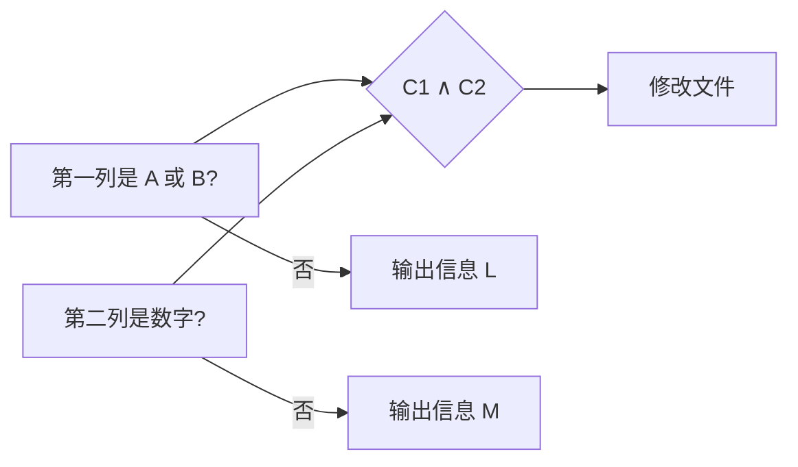
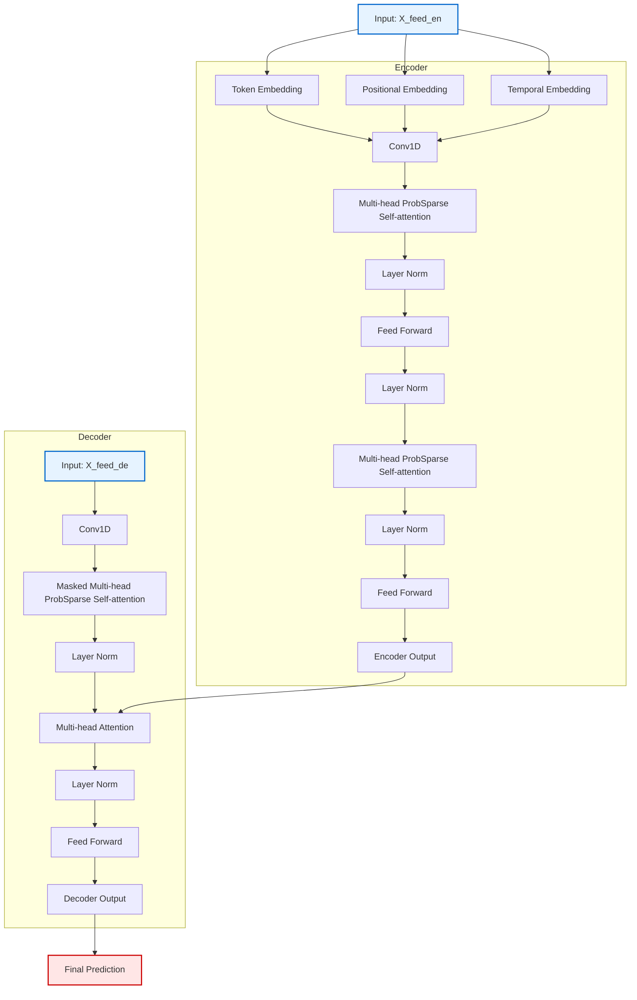

```mermaid
flowchart LR
C1[第一列是 A 或 B?]
C2[第二列是数字?]
C1 --> AND{C1 ∧ C2}
C2 --> AND
AND --> E1[修改文件]
C1 -- 否 --> E2[输出信息 L]
C2 -- 否 --> E3[输出信息 M]
```

```mermaid
graph TD
    %% 输入部分
    Input[Input: X_feed_en] --> TokenEmb[Token Embedding]
    Input --> PosEmb[Positional Embedding]
    Input --> TempEmb[Temporal Embedding]
    
    %% Encoder部分
    subgraph Encoder
        direction TB
        TokenEmb --> E1[Conv1D]
        PosEmb --> E1
        TempEmb --> E1
        
        E1 --> Attn1[Multi-head ProbSparse Self-attention]
        Attn1 --> Norm1[Layer Norm]
        Norm1 --> FFN1[Feed Forward]
        FFN1 --> Norm2[Layer Norm]
        
        Norm2 --> Attn2[Multi-head ProbSparse Self-attention]
        Attn2 --> Norm3[Layer Norm]
        Norm3 --> FFN2[Feed Forward]
        FFN2 --> EncOut[Encoder Output]
    end

    %% Decoder部分
    subgraph Decoder
        direction TB
        DecoderInput[Input: X_feed_de] --> D1[Conv1D]
        D1 --> MaskAttn[Masked Multi-head ProbSparse Self-attention]
        MaskAttn --> Norm4[Layer Norm]
        Norm4 --> CrossAttn[Multi-head Attention]
        CrossAttn --> Norm5[Layer Norm]
        Norm5 --> FFN3[Feed Forward]
        FFN3 --> DecOut[Decoder Output]
    end

    %% 连接线
    EncOut --> CrossAttn
    DecOut --> Output[Final Prediction]
    
    %% 样式调整
    classDef inputStyle fill:#e6f3ff,stroke:#0066cc,stroke-width:2px
    classDef outputStyle fill:#ffe6e6,stroke:#cc0000,stroke-width:2px
    class Input,DecoderInput inputStyle
    class Output outputStyle
```