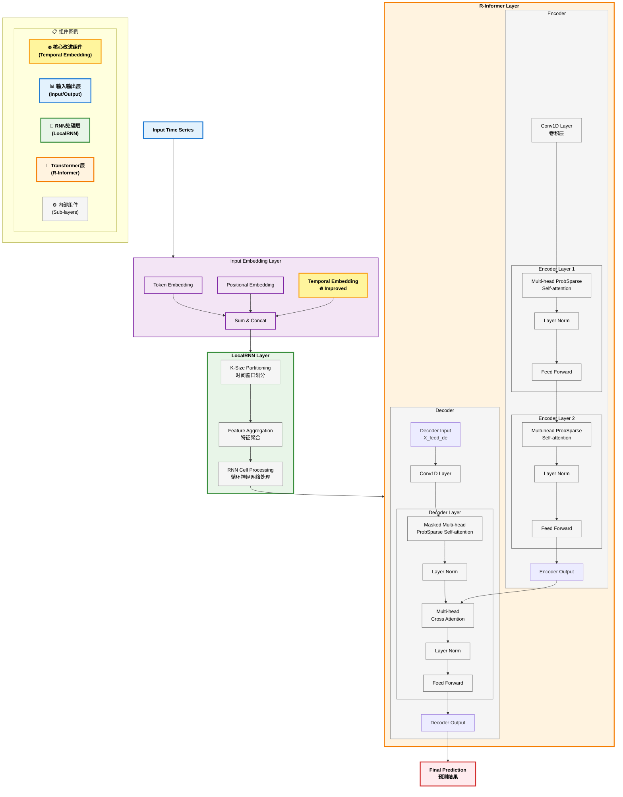

```mermaid
graph TD
    %% 输入层
    Input[Input Time Series] --> InputEmbedding[Input Embedding Layer]
    
    %% Input Embedding层详细结构
    subgraph InputEmbedding[Input Embedding Layer]
        direction LR
        TokenEmb[Token Embedding]
        PosEmb[Positional Embedding]
        TempEmb[Temporal Embedding<br/>🔥 Improved]
        
        TokenEmb --> EmbSum[Sum & Concat]
        PosEmb --> EmbSum
        TempEmb --> EmbSum
    end
    
    %% LocalRNN层
    EmbSum --> LocalRNN[LocalRNN Layer]
    
    subgraph LocalRNN[LocalRNN Layer]
        direction TB
        KSizeDiv[K-Size Partitioning<br/>时间窗口划分]
        FeatureAgg[Feature Aggregation<br/>特征聚合]
        RNNCell[RNN Cell Processing<br/>循环神经网络处理]
        
        KSizeDiv --> FeatureAgg
        FeatureAgg --> RNNCell
    end
    
    %% R-Informer层
    RNNCell --> RInformer[R-Informer Layer]
    
    subgraph RInformer[R-Informer Layer]
        direction TB
        
        %% Encoder部分
        subgraph Encoder[Encoder]
            direction TB
            Conv1D[Conv1D Layer<br/>卷积层]
            
            subgraph EncLayer1[Encoder Layer 1]
                Attn1[Multi-head ProbSparse<br/>Self-attention]
                Norm1[Layer Norm]
                FFN1[Feed Forward]
            end
            
            subgraph EncLayer2[Encoder Layer 2]
                Attn2[Multi-head ProbSparse<br/>Self-attention]
                Norm2[Layer Norm]
                FFN2[Feed Forward]
            end
            
            Conv1D --> Attn1
            Attn1 --> Norm1
            Norm1 --> FFN1
            FFN1 --> Attn2
            Attn2 --> Norm2
            Norm2 --> FFN2
            FFN2 --> EncOut[Encoder Output]
        end
        
        %% Decoder部分
        subgraph Decoder[Decoder]
            direction TB
            DecoderInput[Decoder Input<br/>X_feed_de]
            DecoderConv[Conv1D Layer]
            
            subgraph DecLayer[Decoder Layer]
                MaskAttn[Masked Multi-head<br/>ProbSparse Self-attention]
                Norm3[Layer Norm]
                CrossAttn[Multi-head<br/>Cross Attention]
                Norm4[Layer Norm]
                FFN3[Feed Forward]
            end
            
            DecoderInput --> DecoderConv
            DecoderConv --> MaskAttn
            MaskAttn --> Norm3
            Norm3 --> CrossAttn
            CrossAttn --> Norm4
            Norm4 --> FFN3
            FFN3 --> DecOut[Decoder Output]
        end
        
        %% 连接
        EncOut --> CrossAttn
    end
    
    %% 输出
    DecOut --> Output[Final Prediction<br/>预测结果]
    
    %% 样式定义
    classDef inputStyle fill:#e3f2fd,stroke:#1976d2,stroke-width:3px,color:#000,font-weight:bold
    classDef embeddingStyle fill:#f3e5f5,stroke:#7b1fa2,stroke-width:2px,color:#000
    classDef rnnStyle fill:#e8f5e8,stroke:#388e3c,stroke-width:3px,color:#000,font-weight:bold
    classDef informerStyle fill:#fff3e0,stroke:#f57c00,stroke-width:3px,color:#000,font-weight:bold
    classDef outputStyle fill:#ffebee,stroke:#d32f2f,stroke-width:3px,color:#000,font-weight:bold
    classDef improvedStyle fill:#fff59d,stroke:#f9a825,stroke-width:3px,color:#000,font-weight:bold
    classDef layerStyle fill:#f5f5f5,stroke:#616161,stroke-width:1px,color:#000
    
    %% 应用样式
    class Input inputStyle
    class InputEmbedding embeddingStyle
    class TokenEmb,PosEmb,EmbSum embeddingStyle
    class TempEmb improvedStyle
    class LocalRNN rnnStyle
    class KSizeDiv,FeatureAgg,RNNCell layerStyle
    class RInformer informerStyle
    class Output outputStyle
    class Encoder,Decoder,EncLayer1,EncLayer2,DecLayer layerStyle
    class Conv1D,DecoderConv,Attn1,Attn2,MaskAttn,CrossAttn,Norm1,Norm2,Norm3,Norm4,FFN1,FFN2,FFN3 layerStyle
    
    %% 美化图例 - 使用更好的布局
    subgraph " "
        subgraph Legend["📋 组件图例"]
            direction LR
            L1["🔥 核心改进组件<br/>(Temporal Embedding)"]
            L2["📊 输入输出层<br/>(Input/Output)"]
            L4["🧠 RNN处理层<br/>(LocalRNN)"]
            L5["🤖 Transformer层<br/>(R-Informer)"]
            L6["⚙️ 内部组件<br/>(Sub-layers)"]
        end
    end
    
    class L1 improvedStyle
    class L2 inputStyle
    class L3 embeddingStyle
    class L4 rnnStyle
    class L5 informerStyle
    class L6 layerStyle
```