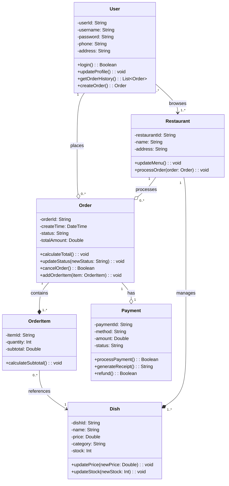
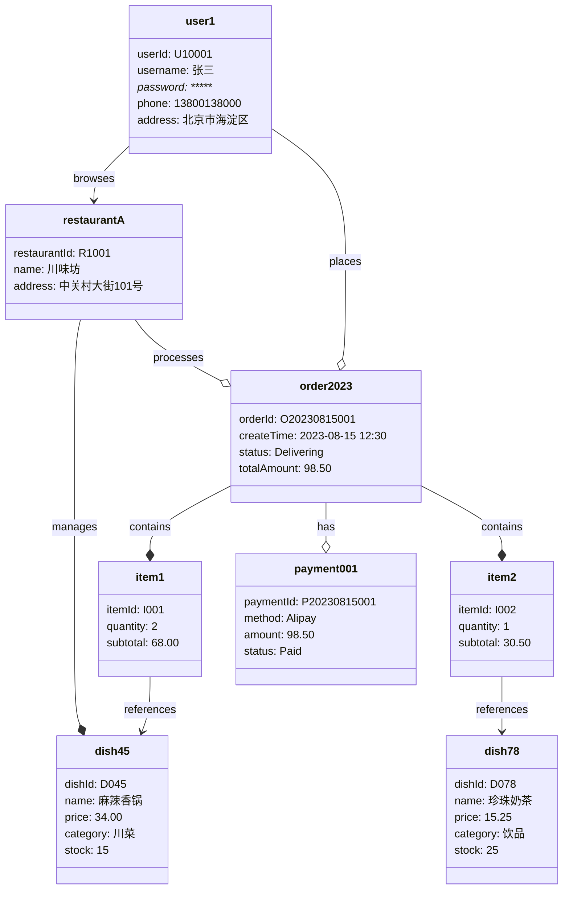
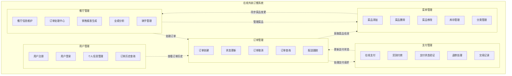

day5 
1.基于今天课堂学习的内容，请优化重构day3作业中类图、对象图（不改动day3已经提交的作业内容，完成后提交为day5的内容）；

2.请基于上述场景，绘制包图，可参考内容及步骤如下：
识别模块：根据功能需求，将系统划分为用户管理、订单管理、菜单管理、支付管理和餐厅管理等主要模块，每个模块应包含相关的功能或子模块。
（1）识别模块：根据功能需求，将系统划分为用户管理、订单管理、菜单管理、支付管理和餐厅管理等主要模块，每个模块应包含相关的功能或子模块。
（2）绘制包图：使用UML包图表示这些模块，标明包之间的依赖关系。例如，用户管理包依赖于订单管理包，订单管理包依赖于菜单管理和支付管理包等。
（3）确定模块内容：
      用户管理包：包含用户注册、登录、个人信息管理等功能。
      订单管理包：包含订单创建、状态更新、取消订单、查看订单历史等功能。
      菜单管理包：包含菜单的添加、删除、修改等功能。
      支付管理包：包含在线支付、货到付款等支付方式的管理。
      餐厅管理包：包含餐厅信息管理、订单处理、销售记录查看等功能。
（4）确定依赖关系：明确标注包之间的依赖关系，例如用户管理包依赖于订单管理包，订单管理包依赖于菜单管理和支付管理包等。

