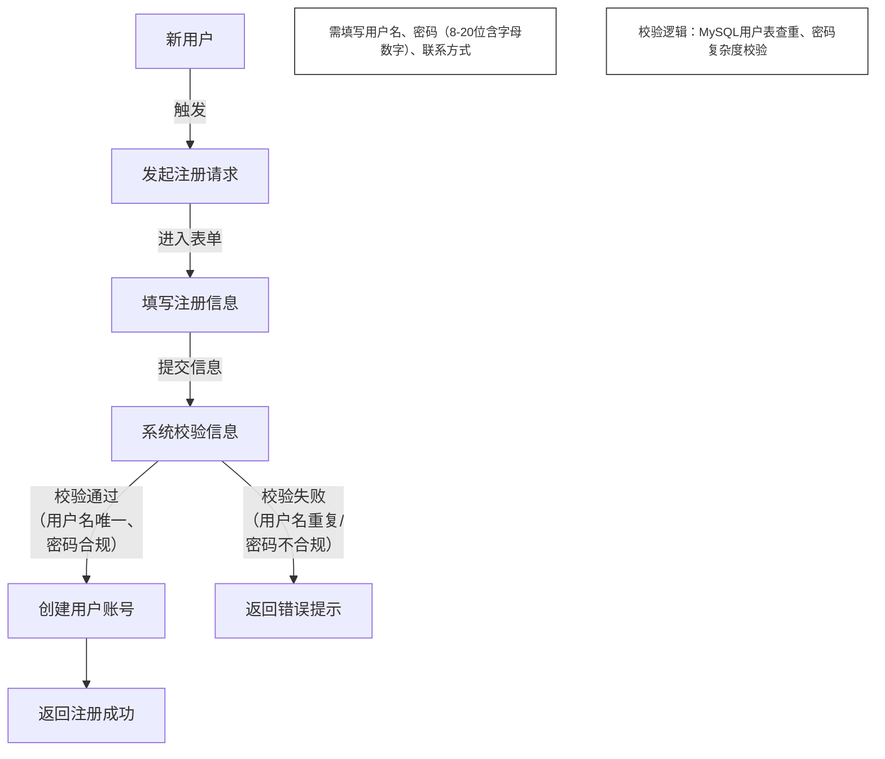

系统分析与设计实训过程材料上传:FTP://10.200.0.91上的账号作如下设置：

学生使用账号密码统一设为：chenghui    Slsd583#


## 1.用户注册



2. ## 用户登录

   ```mermaid
   graph TD
       A[已注册用户] -->|输入信息| B[输入用户名密码]
       B -->|点击登录| C[系统验证身份]
       C -->|验证通过<br/>（密码MD5比对一致）| D[生成JWT令牌]
       D --> E[跳转系统首页]
       C -->|验证失败<br/>（用户名不存在/密码错误）| F[返回错误提示]
       F -->|连续5次错误触发| G[锁定账号]
       
       note1[从MySQL用户表查询用户记录，比对加密密码]:::note
       note2[账号锁定时长1小时]:::note
       
       classDef note fill:#fff,stroke:#333,stroke-width:1px,font-size:12px
   ```

   

3. ## 用户信息修改

   ```mermaid
   graph TD
       A[已登录用户] -->|触发操作| B[进入个人中心]
       B -->|选择功能| C[选择信息修改]
       C -->|编辑联系方式/邮箱| D[填写新信息]
       D -->|提交修改| E[系统校验信息]
       E -->|校验通过<br/>（邮箱含@符号）| F[更新数据库]
       F --> G[返回修改成功]
       E -->|校验失败<br/>（信息格式错误）| H[返回错误提示]
       
       note[仅更新用户个人可编辑字段，不涉及角色权限]:::note
       
       classDef note fill:#fff,stroke:#333,stroke-width:1px,font-size:12px
   ```

   

4. ## 密码重置

   ```mermaid
   graph TD
       subgraph 已登录场景
           A[已登录用户] -->|个人中心触发| B[进入密码重置]
           B --> C[输入原密码新密码]
       end
       
       subgraph 忘记密码场景
           D[忘记密码用户] -->|登录页触发| E[进入忘记密码页]
           E --> F[输入用户名手机号]
           F -->|MySQL校验用户-手机号绑定| G[获取验证码]
           G --> H[输入验证码新密码]
       end
       
       C --> I[系统验证]
       H --> I
       I -->|验证通过| J[更新密码]
       J --> K[返回成功]
       I -->|验证失败<br/>（原密码错误/<br>验证码无效）| L[返回错误]
       
       classDef note fill:#f9f,stroke:#333,stroke-width:1px,font-size:12px
   ```

   

5. ## 角色管理

   ```mermaid
   graph TD
       A[超级管理员] -->|系统管理页触发| B[进入角色管理模块]
       
       subgraph 角色定义流程
           B -->|选择新增角色| C[角色定义：输入角色信息]
           C --> D[角色定义：创建角色]
           D -->|MySQL角色表新增记录| E[返回操作成功]
           C -->|角色名重复| F[返回错误提示]
       end
       
       subgraph 权限分配流程
           B -->|选择已有角色| G[权限分配：选择目标角色]
           G --> H[权限分配：勾选权限项]
           H --> I[更新角色权限]
           I -->|MySQL角色权限关联表更新| E
           H -->|未勾选任何权限| F
       end
       
       classDef note fill:#fff,stroke:#333,stroke-width:1px,font-size:12px
   ```

   

6. ## 用户角色关联

   ```mermaid
   graph TD
       A[超级管理员] -->|系统管理页触发| B[进入用户管理模块]
       B -->|从用户列表选择| C[选择目标用户]
       C -->|操作列选择功能| D[点击角色关联]
       D -->|下拉选择角色<br>（如设备操作员）| E[选择角色（可多选）]
       E -->|提交关联<br>（删除原关联记录）| F[更新用户角色]
       F -->|MySQL用户角色关联表更新| G[返回关联成功]
       E -->|未选择任何角色| H[返回错误提示]
       
       note[用户下次登录生效新角色权限]:::note
       
       classDef note fill:#fff,stroke:#333,stroke-width:1px,font-size:12px
   ```

   

7. ## 多源数据抽取

   ```mermaid
   graph TD
       subgraph 手动触发流程
           A[数据管理员] -->|ETL模块触发| B[手动触发：选择数据源/模式<br/>（MySQL/InfluxDB/MongoDB）]
       end
       
       subgraph 定时触发流程
           C[系统定时任务] -->|预设时间触发| D[定时触发：Airflow按策略执行<br/>（凌晨2点全量/每小时增量）]
       end
       
       B --> E[执行Python抽取脚本]
       D --> E
       E -->|记录时间/数据源/数据量/状态| F[记录抽取日志]
       F -->|手动触发场景| G[返回抽取结果]
       F -->|定时触发场景| H[生成任务报告]
       
       note[脚本依赖pymysql/influxdbpython/pymongo库]:::note
       
       classDef note fill:#fff,stroke:#333,stroke-width:1px,font-size:12px
   ```

   

8. ## 数据转换

   ```mermaid
   graph TD
       A[系统ETL流程] -->|数据抽取完成后触发| B[接收抽取原始数据]
       B -->|启动去噪| C[去噪处理<br/>（去重/补全/修正阈值外数据）]
       C -->|去噪完成| D[格式统一<br/>（时间格式/单位/精度/特殊字符）]
       C -->|关键字段缺失>10%| E[记录错误日志]
       D -->|单位转换规则错误| E
       D -->|按MySQL目标模型重组| F[数据映射]
       F --> G[生成规范数据]
       G --> H[传递至数据加载]
       E --> I[终止转换]
       
       note[数值型缺失用线性插值，文本型用NULL填充]:::note
       
       classDef note fill:#fff,stroke:#333,stroke-width:1px,font-size:12px
   ```

   

9. ## 数据加载

   ```mermaid
   graph TD
       A[系统ETL流程] -->|数据转换完成后触发| B[接收转换规范数据]
       B -->|系统自动选择| C[选择加载模式<br/>（初始化：全量；日常：增量）]
       C -->|全量：清空目标表<br/>增量：按时间戳加载| D[执行加载]
       D -->|实时监控进度/成功失败数据量| E[监控加载状态]
       E -->|加载成功| F[更新数据库<br/>（MySQL/InfluxDB）]
       F --> G[生成加载报告<br/>（含加载量/耗时）]
       E -->|加载失败<br/>（数据库连接错）| H[触发告警<br/>（自动重试3次）]
       H -->|重试失败| I[记录错误日志<br/>（含错误数据信息）]
       
       note[依赖SQLAlchemy ORM框架执行数据库操作]:::note
       
       classDef note fill:#fff,stroke:#333,stroke-width:1px,font-size:12px
   ```

   

10. ## 模型训练

    ```mermaid
    graph TD
        A[深度学习工程师] -->|系统模型管理页触发| B[进入模型训练模块]
        B -->|选择LSTM或RInformer| C[选择模型类型]
        C -->|上传预处理数据| D[上传训练数据<br/>（7:2:1划分训练/验证/测试集）]
        D -->|配置参数| E[配置训练参数<br/>（batch=32/epoch=50/学习率=0.001）]
        E -->|提交启动| F[启动训练<br/>（基于PyTorch框架）]
        F -->|展示训练损失/验证损失曲线| G[监控训练过程]
        G -->|训练完成后评估| H[评估模型性能<br/>（LSTM：≥0.82；RInformer：≥0.89）]
        H -->|评估通过| I[保存模型<br/>（序列化存储state_dict/ONNX）]
        D -->|数据格式错误| J[返回失败提示]
        F -->|GPU资源不足| J
        
        classDef note fill:#f9f,stroke:#333,stroke-width:1px,font-size:12px
    ```

    

11. ## 模型部署

    ```mermaid
    graph TD
        A[深度学习工程师] -->|选择训练好的模型| B[模型序列化<br/>（state_dict/ONNX）]
        C[系统运维工程师] -->|开发接口| D[搭建Flask模型服务接口<br/>（接收设备数据→返回预测结果）]
        D -->|注册服务| E[注册至故障判断服务]
        E -->|传入测试数据验证| F[测试接口]
        F -->|测试通过| G[部署完成<br/>（业务层可调用）]
        B -->|模型文件损坏| H[返回部署失败]
        E -->|与故障判断服务通信异常| H
        
        note[接口需支持高并发预测请求处理]:::note
        
        classDef note fill:#fff,stroke:#333,stroke-width:1px,font-size:12px
    ```

    

12. ## 故障诊断

    ```mermaid
    graph TD
        A[系统] -->|从InfluxDB采集| B[实时采集设备运行数据<br/>（电压/转速/压力）]
        B -->|传递数据至服务层| C[调用故障判断服务]
        C -->|调用LSTM/RInformer模型| D[分析数据判断故障<br/>（故障概率≥0.8判定故障）]
        D -->|判定故障| E[触发故障预警<br/>（系统消息/短信通知）]
        E --> F[设备操作员]
        F -->|查看详情| G[查看预警信息<br/>（设备ID/故障类型/时间）]
        G --> H[处理故障]
        H -->|记录结果| I[记录处理结果<br/>（至MySQL故障记录表）]
        D -->|判定无故障| J[更新设备状态<br/>（仪表盘绿色）]
        
        note[模型输出故障类型概率分布，取最大概率类型]:::note
        
        classDef note fill:#fff,stroke:#333,stroke-width:1px,font-size:12px
    ```

    

13. ## 能效监测

    ```mermaid
    graph TD
        A[系统] -->|采集数据| B[采集运行与能耗数据<br/>（InfluxDB运行数据+电表/燃料仪能耗）]
        B -->|每5分钟计算| C[计算能效指标<br/>（单位产品能耗=总能耗/产量<br/>能耗效率=有效能耗/总能耗）]
        C -->|对比过去3个月| D[对比历史正常区间]
        D -->|指标正常| E[展示指标趋势<br/>（ECharts日/周能耗）]
        D -->|指标异常| F[触发能效异常告警<br/>（企业微信通知）]
        G[能效分析师] -->|查看看板| F
        F --> H[查看异常指标]
        H --> I[分析异常原因<br/>（参数异常/操作不当）]
        
        note[能耗波动系数=能耗标准差/能耗平均值]:::note
        
        classDef note fill:#fff,stroke:#333,stroke-width:1px,font-size:12px
    ```

    

14. ## 能效优化策略生成

    ```mermaid
    graph TD
        A[能效分析师] -->|系统功能页触发| B[进入能效优化模块]
        B -->|从异常设备列表选择| C[选择异常设备]
        C -->|点击“生成策略”| D[触发策略生成]
        D -->|调用GPT4 API| E[调用大模型API<br/>（输入异常信息/运行数据/生产计划/历史案例）]
        E -->|输出初步建议| F[生成初步建议<br/>（调整转速/优化启停）]
        F -->|剔除冲突建议| G[筛选优化建议]
        G -->|分析师补充经验| H[生成最终策略<br/>（存MySQL策略表）]
        E -->|API调用失败| I[返回生成失败]
        G -->|无有效建议| I
        
        classDef note fill:#fff,stroke:#333,stroke-width:1px,font-size:12px
    ```

    

15. ## 优化策略执行与反馈

    ```mermaid
    graph TD
        A[设备操作员] -->|接收系统下发| B[接收能效优化策略<br/>（执行时间/步骤）]
        B -->|按步骤操作| C[执行策略操作<br/>（如调整转速至指定值）]
        C -->|执行完成| D[标记执行状态<br/>（“已执行”）]
        E[系统] -->|实时监测| F[监测能效变化<br/>（能耗/能效指标）]
        F -->|Analyst评估| G[评估优化效果<br/>（能效提升≥5%达标）]
        G -->|达标| H[策略闭环<br/>（记录效果至MySQL）]
        G -->|不达标| I[反馈至大模型<br/>（补充提示词）]
        I --> J[重新生成策略]
        J --> B
        
        classDef note fill:#fff,stroke:#333,stroke-width:1px,font-size:12px
    ```

    

16. ## 可视化仪表盘展示

    ```mermaid
    graph TD
        A[已登录用户<br/>（管理员/操作员/分析师）] -->|完成登录| B[登录系统]
        B -->|按角色跳转| C[跳转对应角色仪表盘<br/>（管理员：全系统数据<br/>操作员：负责区域数据）]
        D[系统] -->|从数据库加载| E[加载仪表盘数据<br/>（MySQL/InfluxDB核心指标）]
        E -->|ECharts/DataV展示| F[可视化展示数据<br/>（数字卡片/饼图/车间布局图）]
        F -->|点击设备图标| G[查看详细数据]
        E -->|数据库查询超时| H[返回加载失败<br/>（提示“稍后刷新”）]
        
        note[核心指标1分钟实时更新<br>设备状态色标（绿正常/黄异常/红故障）]:::note
        
        classDef note fill:#fff,stroke:#333,stroke-width:1px,font-size:14px
    ```

    

17. ## 设备信息管理

    ```mermaid
    graph TD
        A[设备管理员] -->|系统设备管理页触发| B[进入设备信息模块]
        
        subgraph 基础信息维护
            B -->|选择功能| C[基础信息维护]
            C -->|操作设备信息| D[新增/修改/删除设备信息<br/>（ID/型号/厂家等）]
            D -->|更新数据库| E[更新MySQL数据库]
            E --> F[返回操作成功]
            D -->|设备ID重复/有关联数据| G[返回错误提示]
        end
        
        subgraph 设备档案管理
            B -->|选择功能| H[设备档案管理]
            H -->|操作文档| I[上传/下载/查看档案<br/>（说明书/图纸）]
            I -->|存储文档| J[存储至MongoDB]
            J --> F
            I -->|上传不支持格式| G
        end
        
        classDef note fill:#f9f,stroke:#333,stroke-width:1px,font-size:12px
    ```

    

18. ## 维护计划制定与任务管理

    ```mermaid
    graph TD
        A[设备管理员] -->|基于设备数据制定| B[制定维护计划<br/>（周期/内容/责任人）]
        B -->|系统自动或手动生成| C[生成维护任务<br/>（存MySQL任务表）]
        C -->|系统消息通知| D[下发任务至维修人员]
        E[维修人员] -->|查看并确认| D
        D --> F[接收并确认任务]
        F -->|现场执行操作| G[执行维护操作<br/>（检查部件/更换润滑油）]
        G -->|记录过程+上传照片| H[记录维护过程结果<br/>（存MongoDB）]
        H --> I[提交验收请求]
        A -->|审核材料| J[验收任务]
        J -->|审核通过| K[任务完成]
        G -->|无法按时完成| L[提交延期申请<br/>（管理员审批）]
        
        classDef note fill:#f9f,stroke:#333,stroke-width:1px,font-size:12px
    ```

    

19. ## 故障处理管理

    ```mermaid
    graph TD
        A[设备操作员] -->|填写故障信息| B[发现并上报故障<br/>（存MySQL故障表）]
        B -->|系统生成| C[生成故障工单<br/>（状态“待派单”）]
        D[设备管理员] -->|分配工单| E[派单至维修人员]
        F[维修人员] -->|接收工单| E
        E -->|接单处理| G[接单处理故障<br/>（工单状态“处理中”）]
        G -->|记录处理详情| H[记录故障处理结果<br/>（原因/方案/时长）]
        H --> I[提交结案申请]
        D -->|审核结案材料| J[审核结案]
        J -->|审核通过| K[工单结案归档<br/>（至故障案例库）]
        G -->|无法解决| L[提交处理异常]
        L --> M[重新派单<br/>（给专业人员）]
        
        classDef note fill:#f9f,stroke:#333,stroke-width:1px,font-size:12px
    ```

    

20. ## 设备报废管理

    ```mermaid
    graph TD
        A[设备管理员] -->|填写报废信息| B[发起报废申请<br/>（原因/残值/环保要求<br/>存MySQL报废申请表）]
        B -->|评估设备现状/性能| C[技术评估<br/>（技术人员出具报告）]
        C -->|技术通过| D[财务评估<br/>（财务人员评估残值/成本）]
        D -->|财务通过| E[管理员审批]
        E -->|审批通过| F[执行设备报废<br/>（出售/拆解/销毁）]
        F -->|记录详情| G[记录报废信息<br/>（时间/方式/经办人<br/>存MySQL报废记录表）]
        G -->|更新状态| H[设备信息归档<br/>（状态“已报废”，档案存MongoDB）]
        C -->|技术评估不通过| I[返回评估/审批不通过]
        D -->|财务评估不通过| I
        E -->|审批不通过| I
        
        classDef note fill:#f9f,stroke:#333,stroke-width:1px,font-size:12px
    ```

    

21. 

22. 